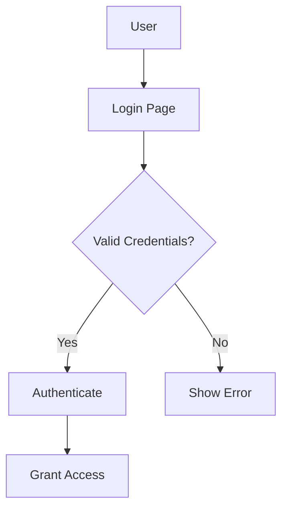
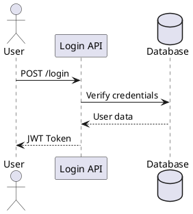

# Diagrams Directory

## Overview

This directory contains all visual diagrams, flowcharts, and technical illustrations used in documentation, presentations, and technical specifications.

## Contents

### Architecture Diagrams

| File | Description |
|------|-------------|
| system-overview.svg | High-level system architecture |
| data-flow.svg | Data flow diagram |
| component-diagram.svg | Component relationships |
| deployment.svg | Deployment architecture |

### Flowcharts

| File | Description |
|------|-------------|
| authentication-flow.svg | User authentication process |
| enrollment-flow.svg | Biometric enrollment process |
| verification-flow.svg | Identity verification process |

### Sequence Diagrams

| File | Description |
|------|-------------|
| api-sequence.svg | API call sequence |
| auth-sequence.svg | Authentication sequence |

### Network Diagrams

| File | Description |
|------|-------------|
| network-topology.svg | Network topology |
| security-zones.svg | Security zones |

## Diagram Standards

### Format
- **Primary**: SVG (vector)
- **Fallback**: PNG (rasterized)

### Dimensions
- **Slide**: 1920x1080
- **Document**: 1200x800
- **Inline**: 600x400

### Color Scheme

| Element | Color |
|---------|-------|
| Primary | #2563EB (Blue) |
| Secondary | #64748B (Slate) |
| Success | #10B981 (Green) |
| Warning | #F59E0B (Amber) |
| Error | #EF4444 (Red) |
| Background | #FFFFFF |

### Font
- **Headings**: Inter Bold, 16pt
- **Labels**: Inter Regular, 12pt
- **Code**: JetBrains Mono, 11pt

## Tooling

### Recommended Tools
- **Draw.io**: Primary diagramming tool
- **Mermaid**: Text-based diagrams
- **PlantUML**: Code-based diagrams
- **Excalidraw**: Quick sketches

### Mermaid Example


### PlantUML Example


## Version Control

Track diagram source files:
```bash
git lfs track "*.svg"
git lfs track "*.drawio"
```

## Maintenance

### Review Cycle
- Review diagrams quarterly
- Update for architectural changes
- Verify accuracy

### Archive Old Versions
```bash
# Archive diagrams
mkdir -p archive/2026-01
mv *.svg archive/2026-01/
```

## Integration

### Documentation
```markdown

```

### Presentations
```markdown
## Authentication Flow

```

## Best Practices

1. **Keep Simple**: Use clear, simple diagrams
2. **Consistent Style**: Follow color scheme
3. **Version Control**: Track source files
4. **Accessibility**: Include alt text

## See Also

- [Architecture Diagrams](./architecture/)
- [Images Directory](../images/)
- [Renders Directory](../renders/)
