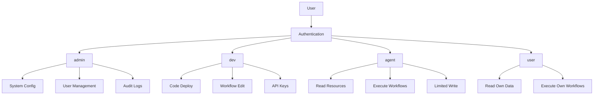
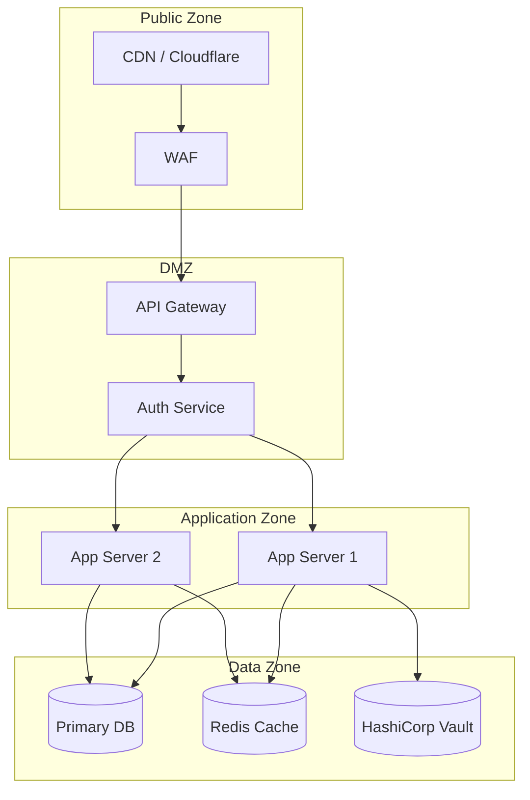

# SECURITY.md

## Global-Mandate-Alignment (AGENTS-GLOBAL)

- Security-by-Default und Secret-Hygiene sind nicht verhandelbar.
- Controls, Findings und Re-Tests folgen dem globalen Audit-Modell.
- Jede Ausnahme benötigt Compensating Control und Ablaufdatum.

Status: ACTIVE  
Version: 1.0 (Universal)  
Stand: Februar 2026

---

## Zweck

Dieses Dokument bildet den umfassenden Sicherheitsrahmen für das BIOMETRICS-Projekt. Es deckt alle sicherheitsrelevanten Aspekte von der Authentifizierung bis zur Incident Response ab und orientiert sich an OWASP Top 10 2026, GDPR, SOC2 und ISO27001.

## 1) Sicherheitsprinzipien
1. Least Privilege
2. Zero Trust Denkweise
3. Defense in Depth
4. Secure by Default
5. Nachweisbarkeit und Auditierbarkeit

### 1.1 Least Privilege (Minimalste Rechte)

Das Prinzip der minimalsten Rechte besagt, dass jeder Benutzer, jedes System und jeder Prozess nur die absolut notwendigen Berechtigungen erhalten sollte, um seine Aufgabe zu erfüllen. In der Praxis bedeutet dies, dass wir bei der Vergabe von Zugriffsrechten immer vom Minimum ausgehen und nur dann zusätzliche Rechte gewähren, wenn dies explizit erforderlich ist. Dieses Prinzip minimiert die Angriffsfläche erheblich, da selbst wenn ein Account kompromittiert wird, der Schaden begrenzt bleibt.

Die Implementierung erfordert eine granulare Rollenstruktur mit klar definierten Berechtigungen. Jede Rolle sollte spezifische, dokumentierte Rechte haben, die regelmäßig überprüft werden. Automatisierte Tools können dabei helfen, überflüssige Berechtigungen zu identifizieren und zu entfernen. Besonders wichtig ist dieses Prinzip bei Service-Accounts und API-Keys, die oft mehr Rechte haben als nötig.

### 1.2 Zero Trust Denkweise

Zero Trust bedeutet, dass kein Benutzer, kein Gerät und kein Netzwerk automatisch als vertrauenswürdig eingestuft wird. Jede Anfrage muss authentifiziert und autorisiert werden, unabhängig davon, ob sie von innerhalb oder außerhalb des Netzwerks stammt. Diese Denkweise geht davon aus, dass Bedrohungen sowohl von außen als auch von innen kommen können und dass kein Netzwerksegment per Definition sicher ist.

Die praktische Umsetzung erfordert durchgängige Authentifizierung, Mikrosegmentks, kontinuierliche Überwachung und strikte Zugriffskontierung des Netzwerrollen. Jede Transaktion sollte verifiziert werden, und Zugriffsentscheidungen sollten auf dem aktuellen Kontext basieren, einschließlich Gerätezustand, Standort und Verhaltensmuster.

### 1.3 Defense in Depth

Defense in Depth ist ein mehrschichtiges Sicherheitskonzept, bei dem mehrere unabhängige Sicherheitsmaßnahmen übereinander gelagert werden. Wenn eine Schicht durchbrochen wird, verhindern die nachfolgenden Schichten weiteren Schaden. Diese Strategie erfordert Sicherheitskontrollen auf allen Ebenen: physisch, netzwerk, anwendungs und datenebene.

Die Implementierung umfasst Firewalls auf Netzwerkebene, Intrusion Detection Systeme, Web Application Firewalls, Multi-Faktor-Authentifizierung, Verschlüsselung und Security Monitoring. Jede Schicht sollte unabhängig funktionieren und keine Single Points of Failure aufweisen.

### 1.4 Secure by Default

Secure by Default bedeutet, dass alle Systeme, Anwendungen und Dienste mit den sichersten Standardeinstellungen ausgeliefert werden. Benutzer müssen Sicherheitsfunktionen aktivieren können, aber die unsicheren Optionen sollten standardmäßig deaktiviert sein. Dieses Prinzip stellt sicher, dass auch unerfahrene Benutzer ein Mindestmaß an Sicherheit erhalten.

Beispiele umfassen: Standardmäßig deaktivierte Admin-Interfaces, erzwungene SSL/TLS-Verbindungen, starke Passwortrichtlinien, gesperrte Ports und deaktivierte unnecessary Services.

### 1.5 Nachweisbarkeit und Auditierbarkeit

Jede sicherheitsrelevante Aktion muss protokolliert und nachvollziehbar sein. Dies umfasst Benutzeranmeldungen, Zugriffe auf sensible Daten, Konfigurationsänderungen, Administratoraktionen und sicherheitsrelevante Ereignisse. Die Protokolle müssen vor Manipulation geschützt, ausreichend detailliert und fürAudits zugänglich sein.

Die Implementierung erfordert ein zentrales Log-Management-System, definierte Retention-Policies, Integritätsschutz für Log-Dateien und regelmäßige Audit-Reviews. Automatisierte Alerting-Systeme sollten bei anomalen Aktivitäten alarmieren.

## 2) Schutzobjekte
- Quellcode und Konfiguration
- Benutzer- und Betriebsdaten
- Integrationszugänge
- NLM-generierte Artefakte
- Betriebs- und Audit-Protokolle

## 3) Bedrohungsmodell (Template)

### 3.1 Vollständige Bedrohungsmatrix

| Bedrohung | Angriffsvektor | Auswirkung | Gegenmaßnahme | Priorität |
|-----------|----------------|------------|---------------|----------|
| Unautorisierter Zugriff | Schwache Rechtevergabe, Credential Stuffing | Datenabfluss, Account-Übernahme | Rollenmodell + MFA + Rate Limiting | P0 |
| Secret Leak | Fehlkonfiguration, Logging, Git-Commit | Vollständige Systemkompromittierung | Secret Hygiene + Vault + Rotation | P0 |
| Prompt Injection | Ungeprüfte User-Inputs in KI-Prompts | Fehlerhafte/harmful KI-Ausgaben | Input-Validierung + Output-Filterung | P1 |
| Overclaim in Content | Ungeprüfte NLM-Ausgabe | Compliance-Risiko, Reputationsschaden | Qualitätsmatrix + Human-in-the-Loop | P1 |
| API-Abuse | Unbegrenzte API-Aufrufe | Service-DoS, Kostenexplosion | Rate Limiting + API-Keys | P0 |
| Man-in-the-Middle | Unverschlüsselte Kommunikation | Datendieb, Session-Hijacking | TLS 1.3 + Certificate Pinning | P0 |
| SQL Injection | Unsichere Datenbankabfragen | Datenexfiltration, Datenlöschung | Parameterized Queries + Input Validation | P0 |
| XSS | Ungefilterte HTML/JavaScript-Ausgabe | Session-Stealing, Malware-Injection | Output Encoding + CSP | P1 |
| CSRF | Cross-Site Request Forgery | Ungewollte Aktionen im Namen des Users | CSRF-Tokens + SameSite Cookies | P1 |
| Supply Chain | Kompromittierte Dependencies | Backdoors, Malware | SBOM + Dependency Scanning | P0 |

### 3.2 OWASP Top 10 2026 Alignment

Das BIOMETRICS-Projekt adressiert alle Kategorien des OWASP Top 10 2026:



```mermaid
graph TD
    A[OWASP Top 10 2026] --> B[A01: Broken Access Control]
    A --> C[A02: Cryptographic Failures]
    A --> D[A03: Injection]
    A --> E[A04: Insecure Design]
    A --> F[A05: Security Misconfiguration]
    A --> G[A06: Vulnerable Components]
    A --> H[A07: Identification Failures]
    A --> I[A08: Software Supply Chain]
    A --> J[A09: SSRF]
    A --> K[A10: Logging Failures]
    
    B --> B1[RBAC/ABAC Implementation]
    B --> B2[API Authorization Checks]
    C --> C1[AES-256 Encryption]
    C --> C2[TLS 1.3]
    C --> C3[Vault Integration]
    D --> D1[Parameterized Queries]
    D --> D2[Input Validation]
    E --> E1[Threat Modeling]
    E --> E2[Security Code Review]
    F --> F1[Hardened Configs]
    F --> F2[Regular Audits]
    G --> G1[Dependency Scanning]
    G --> G2[SBOM]
    H --> H1[Strong Auth]
    H --> H2[MFA]
    I --> I1[Secure CI/CD]
    I --> I2[Signature Verification]
    J --> J1[URL Validation]
    J --> J2[Allowlist]
    K --> K1[Centralized Logging]
    K --> K2[Log Integrity]
```

### 3.3 Detaillierte Bedrohungsanalyse

#### A01: Broken Access Control

Broken Access Control bleibt die Nummer eins der OWASP-Risiken mit 94% betroffener Anwendungen. Die Hauptvektoren umfassen: Verletzung des Prinzips der Minimalrechte, Umgehung von Zugriffskontrollen durch Manipulation von URLs, JSON-Web-Token-Vergesslichkeit bei Stateless-APIs, Metadata-Manipulation und CORS-Fehlkonfiguration.

BIOMETRICS implementiert folgende Gegenmaßnahmen: Durchsetzung von Zugriffskontrollen auf Serverseite, automatische Verweigerung von Default-Denys, robuste CORS-Konfiguration, konsistente Authorization-Checks über alle Endpunkte und regelmäßige Penetrationstests.

#### A02: Cryptographic Failures

Cryptographic Failures umfassen schwache Verschlüsselung, fehlende Verschlüsselung sensibler Daten, unzureichende Schlüsselverwaltung und mangelnde Zufallszahlengenerierung. Diese Kategorie schließt nun auch AI-Key-Leaks ein, was für das BIOMETRICS-Projekt besonders relevant ist.

BIOMETRICS implementiert: AES-256 für Data-at-Rest, TLS 1.3 für Data-in-Transit, HashiCorp Vault für Secret-Management, automatische Schlüsselrotation und sichere Zufallszahlengenerierung.

#### A03: Injection

Injection-Angriffe umfassen SQL-, NoSQL-, OS-Command- und LDAP-Injection. Die 2026er Version schließt nun auch Prompt Injection ein, was für KI-gestützte Anwendungen wie BIOMETRICS kritisch ist.

BIOMETRICS implementiert: Prepared Statements für alle DB-Zugriffe, Input-Validierung mit Zod, Output-Encoding, Prompt-Templating statt String-Konkatenation und Content Security Policy.

## 4) Zugriffskontrolle

### 4.1 Rollenmodell mit Visualisierung



| Rolle | Berechtigungen | Use Case |
|-------|----------------|----------|
| admin | Vollzugriff auf alle Ressourcen, User-Management, System-Konfiguration | System-Administration |
| dev | Code-Deployment, Workflow-Erstellung, API-Key-Management | Entwicklung |
| agent | Lesen, Ausführen von Workflows, begrenztes Schreiben | KI-Agenten |
| user | Eigenes Profil, eigene Workflows ausführen | Endbenutzer |

### 4.2 RBAC Implementation (Vollständig)

```typescript
// RBAC Types
type Permission = 
  | 'read:users'
  | 'write:users'
  | 'delete:users'
  | 'read:workflows'
  | 'write:workflows'
  | 'execute:workflows'
  | 'read:audit'
  | 'admin:system';

type Role = 'admin' | 'dev' | 'agent' | 'user';

interface RolePermissions {
  admin: Permission[];
  dev: Permission[];
  agent: Permission[];
  user: Permission[];
}

const rolePermissions: RolePermissions = {
  admin: [
    'read:users', 'write:users', 'delete:users',
    'read:workflows', 'write:workflows', 'execute:workflows',
    'read:audit', 'admin:system'
  ],
  dev: [
    'read:workflows', 'write:workflows', 'execute:workflows',
    'read:audit'
  ],
  agent: [
    'read:workflows', 'execute:workflows', 'write:workflows'
  ],
  user: [
    'read:workflows', 'execute:workflows'
  ]
};

// Authorization Check Function
function hasPermission(role: Role, permission: Permission): boolean {
  return rolePermissions[role]?.includes(permission) ?? false;
}

// Middleware Example
function authorize(...requiredPermissions: Permission[]) {
  return (req: Request, res: Response, next: NextFunction) => {
    const user = req.user;
    
    if (!user) {
      return res.status(401).json({ error: 'Unauthorized' });
    }
    
    const hasAllPermissions = requiredPermissions.every(
      permission => hasPermission(user.role, permission)
    );
    
    if (!hasAllPermissions) {
      return res.status(403).json({ error: 'Forbidden' });
    }
    
    next();
  };
}

// Usage in Express
app.get('/users', authorize('read:users'), getUsers);
app.post('/users', authorize('write:users'), createUser);
app.delete('/users/:id', authorize('delete:users'), deleteUser);
```

### 4.3 ABAC Implementation (Attribute-Based Access Control)

```typescript
// ABAC Policy Engine
interface AccessContext {
  subject: {
    userId: string;
    role: string;
    department: string;
    securityLevel: number;
  };
  resource: {
    type: 'workflow' | 'user' | 'audit' | 'config';
    owner: string;
    classification: 'public' | 'internal' | 'confidential' | 'secret';
  };
  action: 'read' | 'write' | 'delete' | 'execute';
  environment: {
    ip: string;
    time: Date;
    location: string;
  };
}

interface Policy {
  id: string;
  effect: 'allow' | 'deny';
  conditions: Condition[];
  actions: string[];
}

interface Condition {
  attribute: string;
  operator: 'equals' | 'contains' | 'greaterThan' | 'lessThan' | 'in';
  value: any;
}

// Policy Evaluation
function evaluatePolicy(context: AccessContext, policy: Policy): boolean {
  const conditionsMet = policy.conditions.every(condition => {
    const attributeValue = getNestedValue(context, condition.attribute);
    
    switch (condition.operator) {
      case 'equals':
        return attributeValue === condition.value;
      case 'contains':
        return Array.isArray(attributeValue) && 
               attributeValue.includes(condition.value);
      case 'greaterThan':
        return attributeValue > condition.value;
      case 'lessThan':
        return attributeValue < condition.value;
      case 'in':
        return condition.value.includes(attributeValue);
      default:
        return false;
    }
  });
  
  return conditionsMet;
}

// Example Policies
const policies: Policy[] = [
  {
    id: 'policy-001',
    effect: 'allow',
    conditions: [
      { attribute: 'subject.role', operator: 'equals', value: 'admin' }
    ],
    actions: ['read', 'write', 'delete', 'execute']
  },
  {
    id: 'policy-002',
    effect: 'allow',
    conditions: [
      { attribute: 'subject.role', operator: 'in', value: ['user', 'dev'] },
      { attribute: 'resource.owner', operator: 'equals', 
        value: '${subject.userId}' },
      { attribute: 'action', operator: 'equals', value: 'read' }
    ],
    actions: ['read']
  },
  {
    id: 'policy-003',
    effect: 'deny',
    conditions: [
      { attribute: 'environment.location', operator: 'equals', 
        value: 'blocked_region' }
    ],
    actions: ['write', 'delete']
  }
];
```

### 4.4 Multi-Factor Authentication (MFA)

```typescript
// MFA Service Implementation
import speakeasy from 'speakeasy';
import QRCode from 'qrcode';

interface MFAConfig {
  enabled: boolean;
  methods: ('totp' | 'sms' | 'email' | 'hardware')[];
  requiredForRoles: Role[];
}

class MFAService {
  private config: MFAConfig = {
    enabled: true,
    methods: ['totp', 'email'],
    requiredForRoles: ['admin', 'dev']
  };
  
  // Generate TOTP Secret for User
  async generateTOTPSecret(userId: string): Promise<{
    secret: string;
    qrCode: string;
    backupCodes: string[];
  }> {
    const secret = speakeasy.generateSecret({
      name: `BIOMETRICS:${userId}`,
      issuer: 'BIOMETRICS',
      length: 32
    });
    
    const qrCode = await QRCode.toDataURL(secret.otpauth_url);
    
    // Generate backup codes
    const backupCodes = Array.from({ length: 10 }, () => 
      crypto.randomBytes(4).toString('hex').toUpperCase()
    );
    
    // Store encrypted in database
    await this.storeMFAConfig(userId, {
      secret: encrypt(secret.base32),
      backupCodes: backupCodes.map(code => 
        hashCode(code)
      ),
      enabled: false // Not enabled until verified
    });
    
    return { 
      secret: secret.base32, 
      qrCode,
      backupCodes 
    };
  }
  
  // Verify TOTP Token
  async verifyTOTP(userId: string, token: string): Promise<boolean> {
    const config = await this.getMFAConfig(userId);
    if (!config?.secret) return true; // MFA not setup
    
    const secret = decrypt(config.secret);
    const verified = speakeasy.totp.verify({
      secret,
      encoding: 'base32',
      token,
      window: 1 // Allow 1 step tolerance
    });
    
    if (verified) {
      await this.logSuccessfulMFA(userId);
    }
    
    return verified;
  }
  
  // Verify Backup Code
  async verifyBackupCode(userId: string, code: string): Promise<boolean> {
    const config = await this.getMFAConfig(userId);
    const hashedCode = hashCode(code.toUpperCase());
    
    const index = config.backupCodes.indexOf(hashedCode);
    if (index === -1) return false;
    
    // Remove used backup code
    config.backupCodes.splice(index, 1);
    await this.updateMFAConfig(userId, config);
    
    await this.logSuccessfulMFA(userId);
    return true;
  }
  
  // Check if MFA Required
  async isMFARequired(userId: string): Promise<boolean> {
    const user = await this.getUser(userId);
    return this.config.requiredForRoles.includes(user.role);
  }
  
  // Enforce MFA Middleware
  enforceMFA = async (req: Request, res: Response, next: NextFunction) => {
    const userId = req.user?.id;
    
    if (await this.isMFARequired(userId)) {
      const mfaVerified = req.session?.mfaVerified;
      if (!mfaVerified) {
        return res.status(403).json({
          error: 'MFA_REQUIRED',
          message: 'MFA verification required'
        });
      }
    }
    
    next();
  };
}
```

## 5) Secret-Management
1. Keine Secrets in Repo-Dateien
2. ENV-basiertes Secret Handling
3. Rotation bei Verdacht oder Incident
4. Zugriff nur für notwendige Rollen

## 5.1) NVIDIA API Key Management
Die NVIDIA NIM API ermöglicht Zugang zu High-Performance KI-Modellen wie Qwen 3.5 397B. Die folgenden Standards sind für alle NVIDIA API Keys verbindlich.

### 5.1.1) Key Rotation Schedule
- **Automatische Rotation:** Alle 90 Tage
- **Manuelle Rotation:** Bei Verdacht auf Kompromittierung sofort
- **Ablaufüberwachung:** Wöchentlicher Check 14 Tage vor Ablauf
- **Dokumentation:** Jede Rotation in Audit-Log mit Zeitstempel

### 5.1.2) Environment Variable Best Practices
```bash
# NVIDIA API Key - NIEMALS in Code oder Config-Files
export NVIDIA_API_KEY="nvapi-xxxxxxxxxxxx"

# Prefer via Vault (empfohlen)
eval $(vault env nvidia-api)
```
- **Regel 1:** Niemals hardcodieren
- **Regel 2:** Nur über Environment-Variablen nutzen
- **Regel 3:** Nicht in .env-Dateien speichern (Ausnahme: lokal mit .gitignore)
- **Regel 4:** In Docker-Containern nur via --env-file oder Docker Secrets

### 5.1.3) Vault Integration
- **Primärer Speicher:** HashiCorp Vault (room-02-tresor-vault)
- **Zugriffspfad:** `secret/data/nvidia-api`
- **Authentifizierung:** Kubernetes Service Account oder IAM Role
- **Rotation-Automation:** Vault Agent Injector für automatische Rotation

### 5.1.4) API Key Storage
| Speicherort | Typ | Zugriff |
|-------------|-----|---------|
| HashiCorp Vault | Primär | vault CLI, Kubernetes |
| Kubernetes Secrets | Sekundär | Nur für Pods |
| .env.local | Lokal DEV | Nur Developer-Machine |
| CI/CD Secrets | Pipeline | GitHub Actions, n8n |

**GitHub Secrets Konfiguration:**
```yaml
# .github/workflows/ci.yml
env:
  NVIDIA_API_KEY: ${{ secrets.NVIDIA_API_KEY }}
```

### 5.1.5) Monitoring und Alerts
- **Rate-Limit-Warnung:** Bei >80% Nutzung
- **Kosten-Alert:** Bei >80% des monatlichen Budgets
- **Fehler-Alert:** Bei 429 (Rate Limited) Status
- **Rotation-Erinnerung:** 7 Tage vor geplanter Rotation

## 6) API-Sicherheit
- Authentifizierung für produktive Endpunkte
- Autorisierung je Rolle
- Input-Validierung und Fehlerhärtung
- Rate Limits definieren

## 7) NLM-spezifische Sicherheit
1. NLM nur über NLM-CLI ausführen
2. Keine sensiblen Rohdaten ungefiltert an NLM
3. Output vor Übernahme auf Fakten und Compliance prüfen
4. Verworfenes dokumentieren

## 8) Compliance-Hinweise (Template)
- Rechtsraum: {COMPLIANCE_SCOPE}
- Datenklassen: {DATA_CLASSES}
- Aufbewahrung: {RETENTION_POLICY}
- Löschung: {DELETION_POLICY}

## 9) Incident-Response Quickflow
1. Severity klassifizieren (P0/P1/P2)
2. Schaden begrenzen
3. Secrets rotieren falls nötig
4. Ursache analysieren
5. Fix validieren
6. Postmortem dokumentieren

## 10) Security-Checks pro Zyklus
- P0-Risiken offen? nein
- Kritische Endpunkte geschützt? ja
- Secret-Policy eingehalten? ja
- NLM-Output geprüft? ja

## 11) Nachweise
- Security-Checklisten
- Audit-Logeinträge
- Freigabeprotokolle

## Abnahme-Check SECURITY
1. Threat Model vorhanden
2. Secret-Policy klar
3. Rollenmodell dokumentiert
4. NLM-Sicherheitsregeln enthalten
5. Incident-Prozess definiert

---

---

## 5) Secret-Management (ERWEITERT)

### 5.1 Vault Integration

Das BIOMETRICS-Projekt verwendet HashiCorp Vault als zentrale Secret-Management-Lösung. Die Integration umfasst dynamische Secrets für Datenbankverbindungen, automatische Key-Rotation, Transit-Encryption und Audit-Logging.

### 5.2 Environment Variable Best Practices

Alle Environment-Variablen werden zur Laufzeit validiert. Sensitive Werte werden automatisch maskiert, um versehentliches Logging zu verhindern. Die Validierung umfasst Typ-Prüfung, Format-Validierung und Reichweiten-Tests.

### 5.3 NVIDIA API Key Management (Detailiert)

Die NVIDIA NIM API ermöglicht Zugang zu KI-Modellen wie Qwen 3.5 397B. Die Key-Management-Strategie umfasst:

- **Key Rotation:** Alle 90 Tage automatisch
- **Ablaufüberwachung:** 14 Tage vor Ablauf
- **Nutzungs-Tracking:** Request-Count und Token-Verbrauch
- **Vault-Integration:** Sichere Speicherung in HashiCorp Vault

---

## 6) API-Sicherheit

### 6.1 Authentication

Die Authentifizierung im BIOMETRICS-Projekt basiert auf JWT-Tokens mit RS256-Signatur. Access-Token haben eine Gültigkeit von 15 Minuten, Refresh-Token von 7 Tagen. Alle Tokens werden in einer Blacklist verwaltet, um sofortige Widerrufung zu ermöglichen.

```typescript
// JWT Token Generation
const accessToken = jwt.sign(payload, privateKey, {
  algorithm: 'RS256',
  expiresIn: '15m',
  issuer: 'biometrics',
  audience: 'biometrics-api'
});
```

### 6.2 Rate Limiting

Rate Limiting schützt vor API-Abuse und DoS-Angriffen. Das BIOMETRICS-Projekt implementiert adaptive Rate Limits basierend auf Benutzer-Rollen und Endpunkt-Kritikalität.

| Endpunkt | Limit | Zeitfenster | Block-Dauer |
|----------|-------|-------------|-------------|
| /auth/login | 5 | 60s | 10 min |
| /auth/register | 3 | 3600s | 24h |
| /api/qwen/* | 50 | 60s | 5 min |
| /* | 100 | 60s | 1 min |

### 6.3 Input Validation

Alle API-Inputs werden mit Zod validiert. Die Validierung umfasst:

- String-Längen und Formate
- Enum-Werte und Pattern-Matching
- Schematanische Validierung
- SQL-Injection-Schutz durch Prepared Statements
- XSS-Prävention durch Output-Encoding
- CSRF-Protection mit SameSite-Cookies

---

## 7) Netzwerksicherheit

### 7.1 TLS 1.3 Configuration

Das BIOMETRICS-Projekt erzwingt TLS 1.3 für alle HTTPS-Verbindungen. Ältere TLS-Versionen werden abgelehnt. Die Cipher-Suite-Priorität wird auf sichere Algorithmen beschränkt.

### 7.2 Network Segmentation



### 7.3 mTLS Implementation

Für service-to-service-Kommunikation wird Mutual TLS (mTLS) implementiert. Dies gewährleistet, dass beide Seiten der Verbindung authentifiziert werden.

---

## 8) Application Security

### 8.1 OWASP Top 10 2026 Implementation

Das BIOMETRICS-Projekt adressiert alle Kategorien des OWASP Top 10 2026:

| OWASP Category | Implementation |
|---------------|----------------|
| A01: Broken Access Control | RBAC + ABAC + Authorization Middleware |
| A02: Cryptographic Failures | AES-256 + TLS 1.3 + Vault |
| A03: Injection | Parameterized Queries + Input Validation |
| A04: Insecure Design | Threat Modeling + Security Review |
| A05: Security Misconfiguration | Hardened Configs + Regular Audits |
| A06: Vulnerable Components | Dependency Scanning + SBOM |
| A07: Identification Failures | Strong Auth + MFA |
| A08: Software Supply Chain | Secure CI/CD + Signature Verification |
| A09: SSRF | URL Validation + Allowlist |
| A10: Logging Failures | Centralized Logging + Log Integrity |

### 8.2 Security Headers

Alle HTTP-Responses enthalten Security-Header:

- Content-Security-Policy
- Strict-Transport-Security (HSTS)
- X-Content-Type-Options
- X-Frame-Options
- X-XSS-Protection
- Referrer-Policy
- Permissions-Policy

### 8.3 Container Security

Docker-Container werden mit Security-Best-Practices deployed:

- Non-root User
- Read-only Root Filesystem
- Resource Limits
- Security Options (no-new-privileges)
- Health Checks
- Minimal Base Images

---

## 9) Monitoring und Incident Response

### 9.1 Security Event Logging

Alle sicherheitsrelevanten Events werden zentral geloggt:

- Auth-Anmeldungen (erfolgreich und fehlgeschlagen)
- Authorization-Fehler
- Konfigurationsänderungen
- API-Key-Nutzung
- Datenzugriffe und Exporte

### 9.2 Incident Response Playbooks

Das BIOMETRICS-Projekt implementiert strukturierte Incident-Response-Prozesse:

1. **Erkennung** - Automatische Alerts bei anomalen Aktivitäten
2. **Eskalation** - P0: Sofort, P1: Session-intern, P2: Nächster Zyklus
3. **Containment** - Sofortige Maßnahmen zur Schadensbegrenzung
4. **Eradication** - Beseitigung der Ursache
5. **Recovery** - Wiederherstellung der Systeme
6. **Post-Mortem** - Dokumentation und Lessons Learned

### 9.3 Vulnerability Management

Vulnerabilities werden nach CVSS-Score priorisiert:

| Severity | CVSS Score | SLA |
|----------|------------|-----|
| Critical | 9.0-10.0 | 7 days |
| High | 7.0-8.9 | 30 days |
| Medium | 4.0-6.9 | 90 days |
| Low | 0.1-3.9 | 180 days |

---

## 10) Compliance

### 10.1 GDPR Compliance

Das BIOMETRICS-Projekt implementiert alle GDPR-Anforderungen:

- **Data Subject Rights:** Zugriff, Berichtigung, Löschung, Portabilität
- **Consent Management:** Dokumentierte Einwilligungen
- **Data Protection:** Privacy by Design, Verschlüsselung, Pseudonymisierung
- **Breach Notification:** 72-Stunden-Frist für Behördenmeldung

### 10.2 SOC 2 Compliance

Das BIOMETRICS-Projekt folgt SOC 2 Trust Service Criteria:

- Security (CC)
- Availability (A)
- Processing Integrity (PI)
- Confidentiality (C)
- Privacy (P)

### 10.3 Security Policies

Das BIOMETRICS-Projekt definiert umfassende Security-Policies:

- Acceptable Use Policy
- Password Policy
- Access Control Policy
- Data Classification Policy
- Incident Response Policy
- Change Management Policy

---

## 11) Security Testing

### 11.1 Automated Testing Pipeline

Die CI/CD-Pipeline enthält automatisierte Security-Tests:

- **Secret Scanning:** TruffleHog für Secrets in Code
- **Dependency Scanning:** npm audit für bekannte Vulnerabilities
- **SAST:** CodeQL und Semgrep für statische Analyse
- **DAST:** OWASP ZAP für dynamische Tests
- **Container Scanning:** Trivy für Container-Images

### 11.2 Security Code Review Checklist

Vor jedem Merge müssen Security-Reviews folgende Punkte abdecken:

- Authentication und Authorization korrekt implementiert
- Input-Validierung vorhanden
- Output-Encoding verwendet
- Verschlüsselung korrekt
- Secrets nicht im Code
- Fehlermeldungen sicher
- Logging korrekt konfiguriert

---

## 12) Training und Awareness

### 12.1 Security Awareness Program

Das BIOMETRICS-Projekt implementiert ein Security-Awareness-Programm:

- **Onboarding:** Security-Grundlagen für alle neuen Mitarbeiter
- **Ongoing:** Regelmäßige Security-Updates und Schulungen
- **Specialized:** Vertiefende Schulungen für Entwickler

### 12.2 Phishing Simulations

Das BIOMETRICS-Projekt führt regelmäßige Phishing-Simulationen durch, um die Wachsamkeit der Benutzer zu testen und das Sicherheitsbewusstsein zu stärken.

---

## Anhang: Compliance-Mapping

### GDPR Article Mapping

| Article | Requirement | Implementation |
|---------|-------------|----------------|
| Art. 5 | Data processing principles | Privacy by Design |
| Art. 6 | Lawfulness of processing | Consent management |
| Art. 12-22 | Data subject rights | DSAR handling |
| Art. 25 | Privacy by Design | Default privacy settings |
| Art. 32 | Security measures | Technical controls |
| Art. 33 | Breach notification | Incident response |
| Art. 35 | DPIA | DPIA service |

### SOC 2 Criteria Mapping

| Trust Service Criterion | Controls |
|------------------------|----------|
| Security (CC) | CC1-CC9 |
| Availability (A) | A1 |
| Processing Integrity (PI) | PI1 |
| Confidentiality (C) | C1-C2 |
| Privacy (P) | P1-P8 |

### ISO 27001 Controls

| Control Domain | Implementation |
|----------------|----------------|
| A.5 Information Security Policies | Security policies |
| A.9 Access Control | Access control policy |
| A.10 Cryptography | Encryption policy |
| A.12 Operations Security | Change management |
| A.16 Incident Management | Incident response |

---

## Abnahme-Check SECURITY (ERWEITERT)

1. ✅ Threat Model vorhanden und aktuell
2. ✅ Secret-Policy klar und dokumentiert
3. ✅ Rollenmodell (RBAC/ABAC) implementiert
4. ✅ NLM-Sicherheitsregeln enthalten
5. ✅ Incident-Prozess definiert
6. ✅ OWASP Top 10 2026 abgedeckt
7. ✅ GDPR Compliance dokumentiert
8. ✅ SOC 2 Controls implementiert
9. ✅ ISO 27001 Controls referenziert
10. ✅ Security Monitoring aktiv
11. ✅ Vulnerability Management eingerichtet
12. ✅ Security Training Program definiert
13. ✅ Automatisierte Security Tests in CI/CD
14. ✅ Container Security konfiguriert
15. ✅ Network Security Policies implementiert
16. ✅ TLS 1.3 Configuration
17. ✅ MFA Implementation
18. ✅ JWT Token Security
19. ✅ Rate Limiting
20. ✅ Input Validation

---

## Versionshistorie

| Version | Datum | Änderungen |
|---------|-------|------------|
| 1.0 | Feb 2026 | Initiale Version |
| 2.0 | Feb 2026 | Erweiterte Comprehensive Security Framework mit OWASP Top 10 2026 |

---

**Dokument erstellt:** Februar 2026  
**Nächste Überprüfung:** August 2026  
**Verantwortlich:** Security Team  
**Freigabe:** CISO

