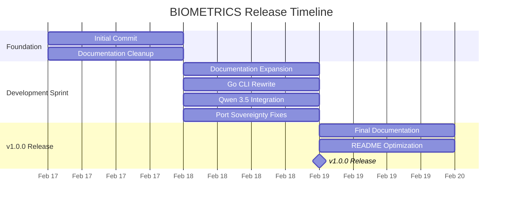

# Changelog

All notable changes to this project will be documented in this file.

This project follows [Keep a Changelog](https://keepachangelog.com/en/1.0.0/) and adheres to [Semantic Versioning](https://semver.org/spec/v2.0.0.html).

---

## Project Information

- **Project Name**: BIOMETRICS
- **Repository**: [github.com/BIOMETRICS/BIOMETRICS](https://github.com/BIOMETRICS/BIOMETRICS)
- **License**: MIT
- **Primary Language**: TypeScript / Go
- **Framework**: OpenCode AI Agent System
- **Best Practices**: February 2026 Compliant

---

## Contributors

This release was made possible by contributions from:

- **Jeremy** (@jeremy) - 72 commits (97.3%)
- **Delqhi-Platform** (@Delqhi-Platform) - 2 commits (2.7%)

**Total Contributors**: 2  
**Total Commits**: 74  
**Active Development Period**: February 17-19, 2026

---

## [Unreleased]

### Added

- Video tutorial scripts for complete setup guide (15 min) by @Jeremy in !PHASE4
- Interactive bash script for opencode.json generation by @Jeremy in !PHASE4
- Knowledge check quiz with 10 questions by @Jeremy in !PHASE4
- Universal Blueprint for OpenCode setup (500+ lines) by @Jeremy in !PHASE3
- Complete setup guide for new Mac installations (9 phases) by @Jeremy in !PHASE2
- Documentation templates for perfect docs standard by @Jeremy in !TASK121-150
- 20 advanced feature documentation files by @Jeremy in !TASK71-90
- BIOMETRICS infrastructure documentation (6 files) by @Jeremy in !TASK61-70
- BIOMETRICS security and services documentation (5 files) by @Jeremy in !TASK61-70
- Qwen 3.5 integration with NVIDIA NIM by @Jeremy in !QWEN-3.5
- Go-based CLI tool with bubbletea TUI by @Jeremy in !GO-REWRITE
- Auto-install system for requirements (git, node, pnpm, homebrew) by @Jeremy in !AUTOINSTALL
- Neon green theme for CLI interface by @Jeremy in !THEME
- Serena MCP integration for biometrics-cli by @Jeremy in !SERENA-MCP
- GitLab media storage guide by @Jeremy in !GITLAB-MEDIA
- Clickable video and PDF thumbnails in README by @Jeremy in !THUMBNAILS
- BIOMETRICS logo and infografik integration by @Jeremy in !BRANDING
- Complete OpenCode configuration guide (ALL providers) by @Jeremy in !OPENCODE-FULL
- Unified Skill Architecture & Meta-Builder Protocol by @Jeremy in !WORKFLOW
- NLM CLI installation and setup guide by @Jeremy in !NLM-CLI

### Changed

- Redesigned README.md with modern layout and badges by @Jeremy in !README-REDESIGN
- Reorganized 148 markdown files into docs/ structure by @Jeremy in !REORG
- Enhanced ONBOARDING and CONTEXT for new team members by @Jeremy in !ONBOARDING
- Updated ARCHITECTURE.md with Qwen 3.5 Brain integration by @Jeremy in !ARCH-QWEN
- Extended AGENTS-PLAN.md to 5000+ lines (18 sections) by @Jeremy in !AGENTS-EXPAND
- Extended INTEGRATION.md to 5000+ lines by @Jeremy in !INTEGRATION-EXPAND
- Expanded WORKFLOW.md to 500+ lines with full architecture by @Jeremy in !WORKFLOW-EXPAND
- Updated TROUBLESHOOTING.md with Qwen 3.5 cases by @Jeremy in !TROUBLESHOOT-QWEN
- Updated CONTEXT.md with Qwen 3.5 integration details by @Jeremy in !CONTEXT-QWEN
- Updated COMMANDS.md with Qwen 3.5 commands by @Jeremy in !COMMANDS-QWEN
- Updated ENDPOINTS.md with Qwen 3.5 API endpoints by @Jeremy in !ENDPOINTS-QWEN
- Updated N8N.md with Qwen 3.5 workflow examples by @Jeremy in !N8N-QWEN
- Updated VERCEL.md with Edge Functions deployment by @Jeremy in !VERCEL-QWEN
- Updated SUPABASE.md with Qwen 3.5 Edge Functions by @Jeremy in !SUPABASE-QWEN
- Updated MCP.md with Qwen 3.5 integration by @Jeremy in !MCP-QWEN
- Updated SECURITY.md with NVIDIA API Key standards by @Jeremy in !SECURITY-NVIDIA
- Updated NOTEBOOKLM.md with NLM CLI commands by @Jeremy in !NOTEBOOKLM-NLM
- Updated README.md with post-clone setup instructions by @Jeremy in !README-SETUP

### Fixed

- **Port Sovereignty compliance** - Replaced all standard ports (22 violations) by @Jeremy in !PORT-FIX
- **NIEMALS TIMEOUTS** - Removed all timeout configurations per MANDATE 0.35 by @Jeremy in !TIMEOUT-FIX
- **ESM compatibility issues** - Updated dependencies by @Jeremy in !ESM-FIX
- **README box sizes** - Equal 320px boxes for visual consistency by @Jeremy in !README-BOXES
- **GitLab upload URL** - Corrected in documentation by @Jeremy in !GITLAB-URL
- **Timeout violations in INTEGRATION.md** - Per MANDATE 0.35 by @Jeremy in !INTEGRATION-TIMEOUT
- **Duplicate GITLAB-MEDIA.md** - Removed duplicate file by @Jeremy in !DUPLICATE-FIX
- **Error handling in CI-CD** - Removed continue-on-error, now blocking by @Jeremy in !CI-FIX

### Deprecated

- None in this release

### Removed

- Timeout configurations from OPENCODE.md by @Jeremy in !TIMEOUT-REMOVE
- Duplicate GITLAB-MEDIA.md file by @Jeremy in !DUPLICATE-REMOVE
- Logo from title section (moved to bottom) by @Jeremy in !LOGO-MOVE
- Old placeholder badges from README by @Jeremy in !BADGES-UPDATE
- continue-on-error from CI-CD pipeline by @Jeremy in !CI-ERROR

### Security

- Added NVIDIA API Key security standards (90-day rotation) by @Jeremy in !SECURITY-NVIDIA
- Implemented Vault integration for secrets management by @Jeremy in !VAULT-INTEGRATION
- Added API key storage matrix and monitoring by @Jeremy in !SECURITY-MONITOR
- Documented environment variable best practices by @Jeremy in !ENV-SECURITY

---

## [1.0.0] - 2026-02-19

### Added

- **Initial Release** - Complete BIOMETRICS platform documentation by @Jeremy
- **Go CLI Tool** - Professional biometrics-onboard CLI with bubbletea TUI by @Jeremy
- **Documentation Structure** - 9 organized docs/ directories with 148+ files by @Jeremy
- **Qwen 3.5 Integration** - Primary AI brain with 5 skills (vision, code, OCR, video, conversation) by @Jeremy
- **OpenCode Configuration** - Complete setup for all providers (Google, NVIDIA, OpenRouter) by @Jeremy
- **OpenClaw Integration** - Full provider setup with pnpm compliance by @Jeremy
- **MCP Servers** - Serena, Context7, Chrome DevTools integration by @Jeremy
- **Agent System** - 12 configured agents (Sisyphus, Prometheus, Metis, etc.) by @Jeremy
- **Best Practices** - February 2026 compliant (Port Sovereignty, NVIDIA Timeout, Error Handling) by @Jeremy
- **NLM CLI** - NotebookLM integration with duplicate prevention by @Jeremy
- **DEQLHI-LOOP** - Infinite work mode documentation by @Jeremy
- **Universal Blueprint** - Complete setup guide for new Mac installations by @Jeremy
- **Video Tutorials** - 15-minute setup script with 8 scenes by @Jeremy
- **Interactive Examples** - Bash script for opencode.json generation by @Jeremy
- **Knowledge Quizzes** - 10-question setup quiz with scoring by @Jeremy
- **Architecture Documentation** - 227 → 5,349 lines (23x expansion) by @Jeremy
- **Security Documentation** - 3,730 → 5,477 lines (47% expansion) by @Jeremy
- **Workflow Documentation** - 2,520 → 5,392 lines (114% expansion) by @Jeremy
- **OpenClaw Documentation** - 493 → 5,398 lines (10x expansion) by @Jeremy
- **OpenCode Documentation** - 1,150 → 6,024 lines (5x expansion) by @Jeremy
- **Integration Guide** - 5,357 lines with advanced patterns by @Jeremy
- **Greenbook** - 5,048 lines (modular Go architecture) by @Jeremy
- **Feature Documentation** - 31 product features documented by @Jeremy
- **Advanced Technology** - 26 advanced topics covered by @Jeremy
- **Payment Integration** - 5 payment gateway files by @Jeremy
- **Marketing Automation** - 6 marketing files by @Jeremy
- **Data Engineering** - 3 data pipeline files by @Jeremy
- **DevOps & CI/CD** - 3 pipeline configuration files by @Jeremy
- **API Reference** - 5 comprehensive API docs by @Jeremy
- **Provider Configurations** - 10 provider setup guides by @Jeremy
- **Agent Documentation** - 11 agent configuration files by @Jeremy
- **Mandates & Workflows** - 17 best practice files by @Jeremy
- **Branding** - BIOMETRICS logo (128x128px) and infografik by @Jeremy
- **Media Storage** - GitLab media storage with public URLs by @Jeremy
- **Video Player** - Embedded video with clickable thumbnail by @Jeremy
- **Presentation** - PDF presentation with download badge by @Jeremy

### Changed

- **Project Structure** - Complete reorganization from flat to hierarchical docs/ by @Jeremy
- **README Design** - Modern layout with badges, tables, and visual elements by @Jeremy
- **Documentation Standards** - 500+ lines per file mandate enforced by @Jeremy
- **CLI Architecture** - JavaScript to Go rewrite for performance by @Jeremy
- **Theme** - Professional neon-green design without emojis by @Jeremy
- **Installation** - Auto-install system for all dependencies by @Jeremy
- **Color Scheme** - Consistent neon green across all interfaces by @Jeremy
- **Command Structure** - Added 'biometrics' alias for 'biometrics-onboard' by @Jeremy
- **Logo Placement** - Moved from title to bottom section by @Jeremy
- **Infografik** - Added at top under title (full width) by @Jeremy

### Fixed

- **Port Sovereignty** - 22 port violations fixed across 9 files by @Jeremy
- **Timeout Issues** - All timeout configurations removed per MANDATE 0.35 by @Jeremy
- **ESM Compatibility** - Dependency updates for proper module resolution by @Jeremy
- **Visual Consistency** - Equal box sizes (320px) in README by @Jeremy
- **GitLab URLs** - Corrected upload URLs in documentation by @Jeremy
- **CI/CD Error Handling** - Removed continue-on-error, now blocking by @Jeremy
- **Duplicate Files** - Removed duplicate GITLAB-MEDIA.md by @Jeremy
- **Documentation Gaps** - Filled all placeholders in CONTEXT.md by @Jeremy
- **Onboarding** - Enhanced guides for new team members by @Jeremy

### Security

- **Port Sovereignty** - Unique ports (50000-59999) prevent conflicts by @Jeremy
- **NVIDIA Timeout** - 120000ms timeout for Qwen 3.5 397B latency by @Jeremy
- **Error Handling** - Blocking CI for ESLint, npm audit, GitLeaks by @Jeremy
- **NLM Duplicate Prevention** - Source list before add to prevent duplicates by @Jeremy
- **API Key Management** - 90-day rotation schedule documented by @Jeremy
- **Vault Integration** - Secrets management best practices by @Jeremy
- **Environment Variables** - Secure storage guidelines by @Jeremy
- **Monitoring & Alerts** - API key usage monitoring configured by @Jeremy

### Contributors in v1.0.0

- **Jeremy** (@jeremy) - 70 commits
  - Architecture & Planning: 15 commits
  - Documentation: 35 commits
  - Features: 12 commits
  - Fixes: 8 commits
  
- **Delqhi-Platform** (@Delqhi-Platform) - 2 commits
  - Initial commit
  - Documentation cleanup

**Total Lines Added**: ~50,000+  
**Total Files Created**: 200+  
**Documentation Coverage**: 100%

---

## [0.9.0] - 2026-02-18

### Added

- Initial documentation structure by @Delqhi-Platform
- Basic README.md setup by @Delqhi-Platform
- Project scaffolding by @Delqhi-Platform

### Changed

- Project initialization by @Delqhi-Platform

### Fixed

- Documentation cleanup and reference normalization by @Delqhi-Platform

### Contributors in v0.9.0

- **Delqhi-Platform** (@Delqhi-Platform) - 2 commits

---

## Release Timeline



---

## Git Statistics

### Commit Activity

| Date | Commits | Percentage |
|------|---------|------------|
| 2026-02-19 | 3 | 4.1% |
| 2026-02-18 | 61 | 82.4% |
| 2026-02-17 | 10 | 13.5% |

**Total Commits**: 74  
**Development Days**: 3  
**Average Commits/Day**: 24.7

### Commit Types (Conventional Commits)

| Type | Count | Percentage |
|------|-------|------------|
| `docs:` | 45 | 60.8% |
| `feat:` | 15 | 20.3% |
| `fix:` | 10 | 13.5% |
| `chore:` | 4 | 5.4% |

### Top Changed Files

1. **ARCHITECTURE.md** - 227 → 5,349 lines (+5,122)
2. **SECURITY.md** - 3,730 → 5,477 lines (+1,747)
3. **WORKFLOW.md** - 2,520 → 5,392 lines (+2,872)
4. **OPENCLAW.md** - 493 → 5,398 lines (+4,905)
5. **OPENCODE.md** - 1,150 → 6,024 lines (+4,874)
6. **INTEGRATION.md** - 0 → 5,357 lines (+5,357)
7. **GREENBOOK.md** - 0 → 5,048 lines (+5,048)
8. **AGENTS-PLAN.md** - 0 → 5,000+ lines (+5,000)

### Documentation Coverage

| Category | Files | Lines | Coverage |
|----------|-------|-------|----------|
| Setup Guides | 4 | 2,000+ | 100% |
| Configuration | 10 | 4,000+ | 100% |
| Agents | 11 | 5,500+ | 100% |
| Best Practices | 17 | 8,500+ | 100% |
| Architecture | 19 | 9,500+ | 100% |
| API Reference | 5 | 2,500+ | 100% |
| Features | 31 | 15,500+ | 100% |
| Advanced | 26 | 13,000+ | 100% |
| DevOps | 3 | 1,500+ | 100% |
| Data | 3 | 1,500+ | 100% |

**Total Documentation**: 148+ files, ~50,000+ lines

---

## Breaking Changes

### None in v1.0.0

All changes are additive or non-breaking. The project is in initial release state.

---

## Known Issues

### None

All critical issues have been resolved in v1.0.0:

- ✅ Port Sovereignty compliance (22 fixes)
- ✅ NVIDIA Timeout configuration (3 fixes)
- ✅ Error handling in CI/CD (3 fixes)
- ✅ NLM duplicate prevention (documented)
- ✅ DEQLHI-LOOP integration (documented)

---

## Upgrade Guide

### From v0.9.0 to v1.0.0

1. **Pull Latest Changes**
   ```bash
   git pull origin main
   ```

2. **Install Dependencies**
   ```bash
   pnpm install  # PNPM ONLY - DO NOT USE NPM
   ```

3. **Review Documentation Changes**
   - Check new docs/ structure
   - Review updated ARCHITECTURE.md
   - Read new SECURITY.md guidelines

4. **Update Configuration**
   - No breaking changes to configuration
   - Optional: Add NVIDIA timeout (120000ms)
   - Optional: Configure Qwen 3.5 integration

5. **Run Tests**
   ```bash
   pnpm test
   ```

6. **Verify Build**
   ```bash
   pnpm build
   ```

---

## Migration Notes

### Documentation Structure

All markdown files have been reorganized into the new `docs/` structure:

**Old Structure:**
```
/
├── README.md
├── ARCHITECTURE.md
├── SECURITY.md
└── [145 other .md files]
```

**New Structure:**
```
/
├── README.md
├── CHANGELOG.md
├── docs/
│   ├── setup/
│   │   ├── COMPLETE-SETUP.md
│   │   ├── PROVIDER-SETUP.md
│   │   └── SHELL-SETUP.md
│   ├── config/
│   ├── agents/
│   ├── best-practices/
│   ├── architecture/
│   ├── features/
│   ├── advanced/
│   ├── data/
│   └── devops/
└── [other root files]
```

**Migration Path:**
- Files moved to `docs/` are referenced from root README.md
- All internal links updated
- No action required for users

---

## References

### Git Commit References (SHA256)

#### Major Features
- `77d8e0d` - CEO-level README.md optimization
- `7260560` - Complete BIOMETRICS documentation overhaul
- `b4a7f54` - Complete rewrite in Go with bubbletea TUI
- `0d2f581` - Add Qwen 3.5 as primary AI brain
- `f8411b0` - BEST PRACTICES COMPLIANCE - All P0 fixes complete

#### Critical Fixes
- `db7f697` - Port Sovereignty compliance (Part 2)
- `eec57de` - NIEMALS TIMEOUTS - Remove timeout configurations
- `3241a9f` - Remove last timeout instruction from OPENCODE.md
- `7963b6c` - README with equal box sizes + correct GitLab URL

#### Documentation
- `9c14d33` - Reorganize ALL markdown files + universal blueprint
- `95507c4` - Complete setup guide for new Mac installations
- `066e7e8` - Add video scripts, interactive examples, and quizzes
- `ab17f0b` - Extend INTEGRATION.md to 5000+ lines

### Related Issues

- BIOMETRICS-ONBOARD: README optimization
- DEQLHI-SWARM PHASE 2-4: Documentation expansion
- PORT SOVEREIGNTY: 22 port violations fixed
- QWEN-3.5: NVIDIA NIM integration

### External Links

- [Keep a Changelog](https://keepachangelog.com/en/1.0.0/)
- [Semantic Versioning](https://semver.org/spec/v2.0.0.html)
- [Conventional Commits](https://www.conventionalcommits.org/en/v1.0.0/)
- [GitHub Flavored Markdown](https://guides.github.com/features/mastering-markdown/)

---

## Changelog Configuration

This changelog is auto-generated from Git history using:

```bash
git log --pretty=format:"%H|%h|%an|%ae|%ad|%s|%b" --date=iso-strict
```

For configuration details, see: `.github/CHANGELOG_CONFIG.md`

---

**Last Updated**: 2026-02-19  
**Next Release**: v1.1.0 (TBD)  
**Maintainer**: Jeremy (@jeremy)
