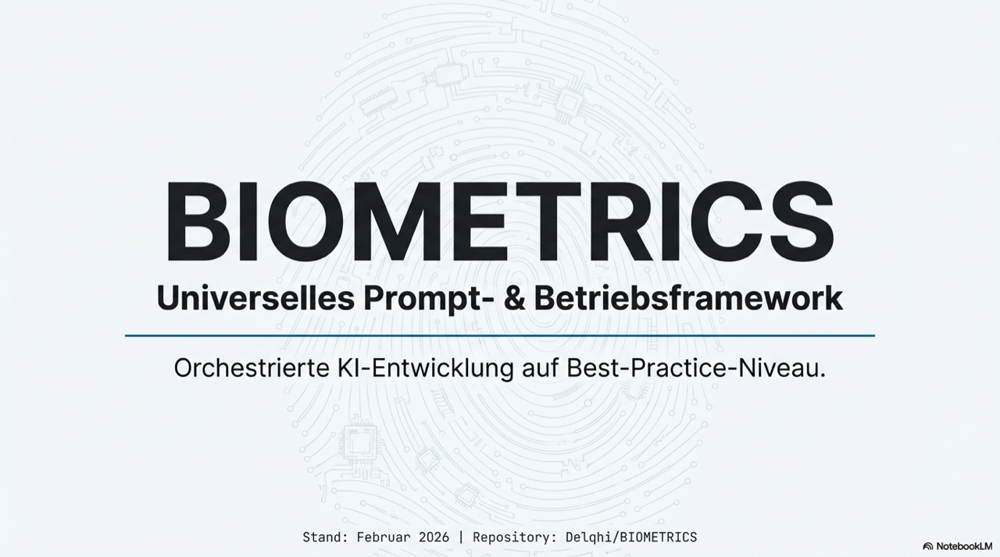

# BIOMETRICS


## 🚀 POST-CLONE SETUP FOR AGENTS

### ⚠️ WICHTIG: REIHENFOLGE EINHALTEN!

**SCHRITT 1: OPENCODE KONFIGURIEREN (ALLERWICHTIGSTER SCHRITT!)**

Opencode MUSS zuerst konfiguriert werden bevor irgendetwas anderes funktioniert!

```bash
# 1. Opencode authentifizieren
opencode auth login

# 2. Konfiguration prüfen
opencode models

# 3. Provider konfigurieren (falls nicht geschehen)
opencode auth add moonshot-ai
opencode auth add kimi-for-coding
opencode auth add opencode-zen
```

**SCHRITT 2: OPENCODE.JSON PRÜFEN**

Stelle sicher dass `~/.config/opencode/opencode.json` korrekt konfiguriert ist:

- ✅ KEINE timeout-Einträge! (MANDATE 0.35)
- ✅ Alle Provider korrekt eingerichtet
- ✅ Models korrekt definiert

**Verifizierung:**
```bash
# Prüfe auf timeout-Einträge (muss LEER sein!)
grep -r "timeout" ~/.config/opencode/opencode.json
```

**SCHRITT 3: OH-MY-OPENCODE.JSON PRÜFEN**

`~/.config/opencode/oh-my-opencode.json` muss korrekt sein:

- ✅ Agent-Modelle korrekt zugewiesen
- ✅ KEINE timeout-Einträge!

**SCHRITT 4: OPENCLAW.JSON PRÜFEN**

`~/.openclaw/openclaw.json` konfigurieren:

- ✅ NVIDIA_API_KEY in env section
- ✅ Models providers korrekt
- ⚠️ HINWEIS: OpenClaw hat timeout in config (wird vom Gateway managed)

**SCHRITT 5: TERMINAL SESSION NEU STARTEN (PFLICHT!)**

⚠️ **NACH DER KONFIGURATION MUSS DAS TERMINAL NEU GESTARTET WERDEN!**

```bash
# Terminal schließen und neu öffnen
# ODER
exec zsh  # Shell neu laden
```

**Warum?** Neue Konfigurationen werden nur nach einem Neustart wirksam!

**SCHRITT 6: VERIFIKATION**

```bash
# Opencode prüfen
opencode --version
opencode models

# OpenClaw prüfen
openclaw doctor --fix

# Alle Dienste sollten ohne Fehler starten
```

### 🚨 HÄUFIGE FEHLER

| Fehler | Lösung |
|--------|--------|
| Timeout in config | SOFORT entfernen! MANDATE 0.35 |
| Models nicht gefunden | Terminal neu starten! |
| Provider nicht auth | `opencode auth add <provider>` |
| OpenClaw nicht gefunden | `~/.openclaw/openclaw.json` prüfen |

### ✅ CHECKLISTE VOR DEM START

- [ ] opencode.json hat KEINE timeout-Einträge
- [ ] oh-my-opencode.json hat KEINE timeout-Einträge
- [ ] openclaw.json wurde geprüft (Gateway managed timeout)
- [ ] Terminal wurde neu gestartet
- [ ] `opencode models` zeigt alle Modelle
- [ ] `openclaw doctor` zeigt keine Fehler

---

## 📚 DOCUMENTATION

**Comprehensive documentation organized by category:**

### 🚀 New Installation?
→ [**docs/setup/COMPLETE-SETUP.md**](docs/setup/COMPLETE-SETUP.md) - Complete installation guide

### ⚙️ Provider Configuration?
→ [**docs/config/**](docs/config/) - All provider configs (NVIDIA, Google, OpenCode ZEN)

### 🤖 Agent Documentation?
→ [**docs/agents/**](docs/agents/) - Agent definitions, mandates, and skills
  - [AGENTS-MANDATES.md](docs/agents/AGENTS-MANDATES.md) - 286KB executive mandates
  - [OH-MY-OPENCODE-AGENTS.md](docs/agents/OH-MY-OPENCODE-AGENTS.md) - Plugin documentation
  - [SKILLS.md](docs/agents/SKILLS.md) - Built-in skills

### 📖 Best Practices?
→ [**docs/best-practices/**](docs/best-practices/) - Mandates, workflows, compliance
  - [MANDATES.md](docs/best-practices/MANDATES.md) - 33 core mandates
  - [WORKFLOW.md](docs/best-practices/WORKFLOW.md) - Work protocols
  - [TROUBLESHOOTING.md](docs/best-practices/TROUBLESHOOTING.md) - Common issues

### 🏗️ Architecture?
→ [**docs/architecture/**](docs/architecture/) - System architecture and components
  - [OVERVIEW.md](docs/architecture/OVERVIEW.md) - System overview
  - [COMPONENTS.md](docs/architecture/COMPONENTS.md) - Component details
  - [API Reference](docs/architecture/api/) - API documentation

### 📋 Universal Blueprint?
→ [**docs/UNIVERSAL-BLUEPRINT.md**](docs/UNIVERSAL-BLUEPRINT.md) - Complete setup guide for ANY agent on ANY Mac

### 🎯 Features?
→ [**docs/features/**](docs/features/) - Product features and capabilities
  - [WEBSITE.md](docs/features/WEBSITE.md) - Website documentation
  - [WEBAPP.md](docs/features/WEBAPP.md) - Web application
  - [WEBSHOP.md](docs/features/WEBSHOP.md) - E-commerce
  - [Payment](docs/features/payment/) - Payment gateway integration
  - [Marketing](docs/features/marketing/) - Marketing automation

### 🔬 Advanced Topics?
→ [**docs/advanced/**](docs/advanced/) - Blockchain, DeFi, AI, and more

### 📊 Data Engineering?
→ [**docs/data/**](docs/data/) - ETL, data lineage, quality

### 🛠️ DevOps?
→ [**docs/devops/**](docs/devops/) - CI/CD, GitHub, GitLab, n8n

---

## 🚀 SCHNELLSTART

### One-Command Installation

**Alles automatisch einrichten - inkl. System-Dependencies:**

```bash
# 1. Repo klonen
git clone https://github.com/Delqhi/BIOMETRICS.git
cd BIOMETRICS/biometrics-cli

# 2. CLI installieren (automatisiert ALLES!)
pnpm install
pnpm link --global

# 3. Onboarding starten (installiert fehlende Dependencies automatisch)
biometrics
```

**Der CLI übernimmt VOLLSTÄNDIG:**
- ✅ **System-Check:** Git, Node.js, pnpm, Homebrew, Python
- ✅ **Auto-Install:** Fehlende Dependencies werden automatisch installiert
- ✅ **PATH-Setup:** Fügt `~/.zshrc` und `~/.bashrc` automatisch hinzu
- ✅ **GitLab:** Erstellt Media-Storage Projekt
- ✅ **NLM CLI:** Installiert + authentifiziert
- ✅ **OpenCode:** Installiert + konfiguriert (optional)
- ✅ **OpenClaw 🦞:** Installiert + konfiguriert (optional)
- ✅ **Google Antigravity:** Plugin + OAuth
- ✅ **Social Media:** WhatsApp, Telegram, Gmail, Twitter (optional)
- ✅ **ClawdBot:** Verbindet alle Channels

**Farbschema:** Neon-Grün (Best Practices 2026)

**Befehle:**
```bash
biometrics           # Kurzversion
biometrics-onboard   # Vollständige Version
```

**Dokumentation:** Siehe [`biometrics-cli/README.md`](./biometrics-cli/README.md)

---

## 🎬 Video & Präsentation

<table>
<tr>
<td align="center" valign="top" width="320">

### 📹 Erklärvideo

[](https://gitlab.com/zukunftsorientierte.energie/biometrics-videos/-/uploads/d23d181f4278365b97454a3c0602d132/video.mp4)

**[Video abspielen ▶](https://gitlab.com/zukunftsorientierte.energie/biometrics-videos/-/uploads/d23d181f4278365b97454a3c0602d132/video.mp4)**

</td>
<td align="center" valign="top" width="320">

### 📄 Präsentation

[](BIOMETRICS/praesentation.pdf)

**[Präsentation öffnen 📄](BIOMETRICS/praesentation.pdf)**

</td>
</tr>
</table>

*Hinweis: Das Video wird von GitLab gestreamt. Bei Wiedergabeproblemen bitte [hier herunterladen](https://gitlab.com/zukunftsorientierte.energie/biometrics-videos/-/uploads/d23d181f4278365b97454a3c0602d132/video.mp4).*

---

## Global-Mandate-Alignment (AGENTS-GLOBAL)

- Verbindliche Leitquelle für Governance: `BIOMETRICS/AGENTS-GLOBAL.md`.
- Dokumentation ist produktiv: Änderungen immer mit Doku-Sync und Nachweis.
- Keine Wissenslöschung ohne Migrationspfad (append-only Prinzip).
- Mapping-, Security-, CI/CD- und Incident-Pflichten sind für alle Artefakte bindend.
- Jede Änderung soll Rule-/Control-Bezug und verantwortliche Rolle klar machen.

Universelles Prompt- und Betriebsframework für orchestrierte KI-Entwicklung auf Best-Practice-Niveau (Stand: Februar 2026).

## Repository-Name

Kanonischer Name: `BIOMETRICS`
Workspace-Pfad in dieser Umgebung: `/workspaces/<workspace>` (technischer Container-Pfad)
Status: BIOMETRICS als verbindlicher Repo-Name verwenden

## Verzeichnisstrategie

- Kanonischer Governance-Hauptordner: `BIOMETRICS/`
- NLM-Artefakte liegen unter: `BIOMETRICS/NLM-ASSETS/`
- Agentenseitig erstellte Projektdokumente sind ausschließlich unter `BIOMETRICS/` zu führen

## Schnellstart

1. `∞Best∞Practices∞Loop.md` lesen
2. `BIOMETRICS/AGENTS.md` und `BIOMETRICS/AGENTS-PLAN.md` lesen
3. `BIOMETRICS/CONTEXT.md` und `BIOMETRICS/ONBOARDING.md` lesen
4. Task auswählen und nach Evidenzstandard ausführen
5. Änderungen in `BIOMETRICS/MEETING.md` und `BIOMETRICS/CHANGELOG.md` dokumentieren

## Leitdokumente

- `∞Best∞Practices∞Loop.md`
- `BIOMETRICS/AGENTS.md`
- `BIOMETRICS/AGENTS-PLAN.md`
- `BIOMETRICS/USER-PLAN.md`
- `BIOMETRICS/MEETING.md`
- `BIOMETRICS/CHANGELOG.md`

## Architektur und Betrieb

- `BIOMETRICS/ARCHITECTURE.md`
- `BIOMETRICS/INFRASTRUCTURE.md`
- `BIOMETRICS/SECURITY.md`
- `BIOMETRICS/SUPABASE.md`
- `BIOMETRICS/INTEGRATION.md`
- `BIOMETRICS/CI-CD-SETUP.md`
- `BIOMETRICS/TROUBLESHOOTING.md`

## Produkt- und Experience-Dokumente

- `BIOMETRICS/WEBSITE.md`
- `BIOMETRICS/WEBAPP.md`
- `BIOMETRICS/WEBSHOP.md`
- `BIOMETRICS/ENGINE.md`
- `BIOMETRICS/ONBOARDING.md`

## Steuerung und API

- `BIOMETRICS/COMMANDS.md`
- `BIOMETRICS/ENDPOINTS.md`
- `BIOMETRICS/MAPPING.md`
- `BIOMETRICS/MAPPING-COMMANDS-ENDPOINTS.md`

## Integrationen und Plattformen

- `BIOMETRICS/NOTEBOOKLM.md`
- `BIOMETRICS/MCP.md`
- `BIOMETRICS/OPENCLAW.md`
- `BIOMETRICS/N8N.md`
- `BIOMETRICS/CLOUDFLARE.md`
- `BIOMETRICS/VERCEL.md`
- `BIOMETRICS/vercel.json`
- `BIOMETRICS/IONOS.md`
- `BIOMETRICS/GITHUB.md`

## Governance

- `BIOMETRICS/CONTRIBUTING.md`
- `BIOMETRICS/CODE_OF_CONDUCT.md`
- `BIOMETRICS/LICENSE`
- `BIOMETRICS/BLUEPRINT.md`

## Basisartefakte

- `BIOMETRICS/package.json`
- `BIOMETRICS/requirements.txt`

## NLM Artefakte (Pflicht)

Freigegebene NLM-Artefakte werden abgelegt und referenziert in:
- `BIOMETRICS/NLM-ASSETS/videos/`
- `BIOMETRICS/NLM-ASSETS/infographics/`
- `BIOMETRICS/NLM-ASSETS/presentations/`
- `BIOMETRICS/NLM-ASSETS/reports/`
- `BIOMETRICS/NLM-ASSETS/tables/`
- `BIOMETRICS/NLM-ASSETS/mindmaps/`
- `BIOMETRICS/NLM-ASSETS/podcasts/`

## Nicht verhandelbare Regeln

1. Erst lesen, dann bearbeiten
2. Keine Done-Meldung ohne Evidenz
3. NLM immer vollumfänglich via NLM-CLI
4. Keine Duplikatdateien
5. Doku-Updates sind Pflicht
6. README bleibt laufend aktuell und referenziert neue NLM-Artefakte

---

## 🤖 Architecture & Automation

Dieses Projekt verwendet einen **Self-Building AI Agent** Ansatz:

- **Brain:** AI/OpenClaw (Entscheidung & Interface)
- **Muscle:** Supabase/n8n (Execution & Automation)
- **Meta-Builder:** Agent baut sich selbst neue Tools

Der Agent kann autonom:
- Supabase Edge Functions schreiben & deployen
- n8n Workflows erstellen & aktivieren
- Neue OpenClaw Skills für sich selbst registrieren

**Vollständige Dokumentation:** Siehe [`WORKFLOW.md`](BIOMETRICS/WORKFLOW.md)

---
