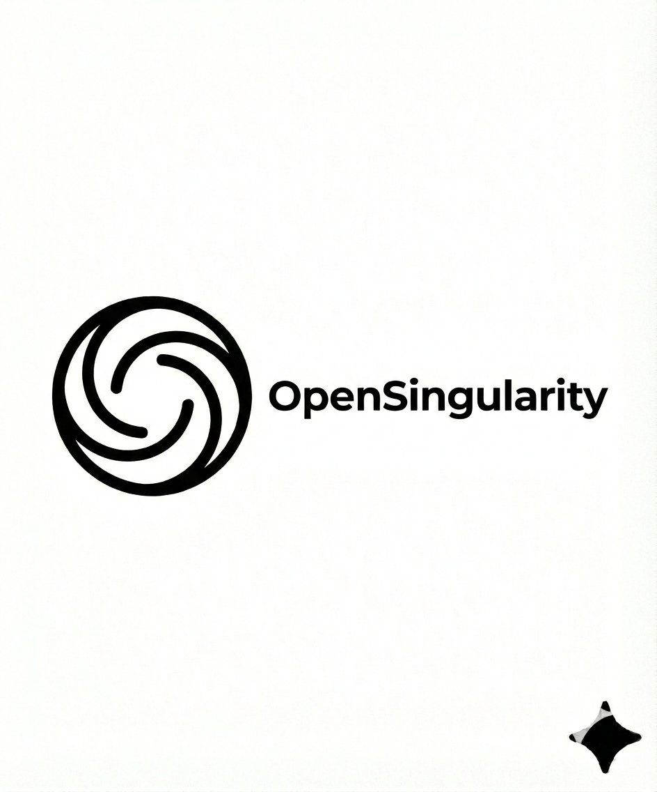

# BIOMETRICS


## 🚀 SCHNELLSTART

### One-Command Installation

Alles mit einem Befehl einrichten:

```bash
npx biometrics-onboard@latest
```

Oder manuell:

```bash
# 1. Repo klonen
git clone https://github.com/Delqhi/BIOMETRICS.git
cd BIOMETRICS

# 2. Onboarding-CLI installieren und ausführen
git clone https://github.com/Delqhi/biometrics-onboard.git
cd biometrics-onboard
pnpm install
pnpm link --global
cd ..
biometrics-onboard
```

**Was automatisch eingerichtet wird:**
- ✅ GitLab Media Storage (für Videos, PDFs, Bilder)
- ✅ NLM CLI (NotebookLM)
- ✅ OpenCode (AI Coding Assistant)
- ✅ OpenClaw (AI Orchestration)
- ✅ Google Antigravity (OAuth)
- ✅ WhatsApp Integration (optional)
- ✅ Telegram Integration (optional)
- ✅ Gmail Integration (optional)
- ✅ Twitter/X Integration (optional)
- ✅ ClawdBot (Social Media Automation)

**Dokumentation:** Siehe [`biometrics-onboard/README.md`](https://github.com/Delqhi/biometrics-onboard) für vollständige Anleitung.

---

## 🎬 Video & Präsentation

<table>
<tr>
<td align="center">

### 📹 Erklärvideo

[](https://gitlab.com/zukunftsorientierte.energie/biometrics-videos/-/uploads/d23d181f4278365b97454a3c0602d132/video.mp4)

**[Video abspielen ▶](https://gitlab.com/zukunftsorientierte.energie/biometrics-videos/-/uploads/d23d181f4278365b97454a3c0602d132/video.mp4)**

</td>
<td align="center">

### 📄 Präsentation

[](BIOMETRICS/praesentation.pdf)

**[Präsentation öffnen 📄](BIOMETRICS/praesentation.pdf)**

</td>
</tr>
</table>

---

## Global-Mandate-Alignment (AGENTS-GLOBAL)

- Verbindliche Leitquelle für Governance: `BIOMETRICS/AGENTS-GLOBAL.md`.
- Dokumentation ist produktiv: Änderungen immer mit Doku-Sync und Nachweis.
- Keine Wissenslöschung ohne Migrationspfad (append-only Prinzip).
- Mapping-, Security-, CI/CD- und Incident-Pflichten sind für alle Artefakte bindend.
- Jede Änderung soll Rule-/Control-Bezug und verantwortliche Rolle klar machen.

Universelles Prompt- und Betriebsframework für orchestrierte KI-Entwicklung auf Best-Practice-Niveau (Stand: Februar 2026).

## Repository-Name

Kanonischer Name: `BIOMETRICS`
Workspace-Pfad in dieser Umgebung: `/workspaces/<workspace>` (technischer Container-Pfad)
Status: BIOMETRICS als verbindlicher Repo-Name verwenden

## Verzeichnisstrategie

- Kanonischer Governance-Hauptordner: `BIOMETRICS/`
- NLM-Artefakte liegen unter: `BIOMETRICS/NLM-ASSETS/`
- Agentenseitig erstellte Projektdokumente sind ausschließlich unter `BIOMETRICS/` zu führen

## Schnellstart

1. `∞Best∞Practices∞Loop.md` lesen
2. `BIOMETRICS/AGENTS.md` und `BIOMETRICS/AGENTS-PLAN.md` lesen
3. `BIOMETRICS/CONTEXT.md` und `BIOMETRICS/ONBOARDING.md` lesen
4. Task auswählen und nach Evidenzstandard ausführen
5. Änderungen in `BIOMETRICS/MEETING.md` und `BIOMETRICS/CHANGELOG.md` dokumentieren

## Leitdokumente

- `∞Best∞Practices∞Loop.md`
- `BIOMETRICS/AGENTS.md`
- `BIOMETRICS/AGENTS-PLAN.md`
- `BIOMETRICS/USER-PLAN.md`
- `BIOMETRICS/MEETING.md`
- `BIOMETRICS/CHANGELOG.md`

## Architektur und Betrieb

- `BIOMETRICS/ARCHITECTURE.md`
- `BIOMETRICS/INFRASTRUCTURE.md`
- `BIOMETRICS/SECURITY.md`
- `BIOMETRICS/SUPABASE.md`
- `BIOMETRICS/INTEGRATION.md`
- `BIOMETRICS/CI-CD-SETUP.md`
- `BIOMETRICS/TROUBLESHOOTING.md`

## Produkt- und Experience-Dokumente

- `BIOMETRICS/WEBSITE.md`
- `BIOMETRICS/WEBAPP.md`
- `BIOMETRICS/WEBSHOP.md`
- `BIOMETRICS/ENGINE.md`
- `BIOMETRICS/ONBOARDING.md`

## Steuerung und API

- `BIOMETRICS/COMMANDS.md`
- `BIOMETRICS/ENDPOINTS.md`
- `BIOMETRICS/MAPPING.md`
- `BIOMETRICS/MAPPING-COMMANDS-ENDPOINTS.md`

## Integrationen und Plattformen

- `BIOMETRICS/NOTEBOOKLM.md`
- `BIOMETRICS/MCP.md`
- `BIOMETRICS/OPENCLAW.md`
- `BIOMETRICS/N8N.md`
- `BIOMETRICS/CLOUDFLARE.md`
- `BIOMETRICS/VERCEL.md`
- `BIOMETRICS/vercel.json`
- `BIOMETRICS/IONOS.md`
- `BIOMETRICS/GITHUB.md`

## Governance

- `BIOMETRICS/CONTRIBUTING.md`
- `BIOMETRICS/CODE_OF_CONDUCT.md`
- `BIOMETRICS/LICENSE`
- `BIOMETRICS/BLUEPRINT.md`

## Basisartefakte

- `BIOMETRICS/package.json`
- `BIOMETRICS/requirements.txt`

## NLM Artefakte (Pflicht)

Freigegebene NLM-Artefakte werden abgelegt und referenziert in:
- `BIOMETRICS/NLM-ASSETS/videos/`
- `BIOMETRICS/NLM-ASSETS/infographics/`
- `BIOMETRICS/NLM-ASSETS/presentations/`
- `BIOMETRICS/NLM-ASSETS/reports/`
- `BIOMETRICS/NLM-ASSETS/tables/`
- `BIOMETRICS/NLM-ASSETS/mindmaps/`
- `BIOMETRICS/NLM-ASSETS/podcasts/`

## Nicht verhandelbare Regeln

1. Erst lesen, dann bearbeiten
2. Keine Done-Meldung ohne Evidenz
3. NLM immer vollumfänglich via NLM-CLI
4. Keine Duplikatdateien
5. Doku-Updates sind Pflicht
6. README bleibt laufend aktuell und referenziert neue NLM-Artefakte

---

## 🤖 Architecture & Automation

Dieses Projekt verwendet einen **Self-Building AI Agent** Ansatz:

- **Brain:** AI/OpenClaw (Entscheidung & Interface)
- **Muscle:** Supabase/n8n (Execution & Automation)
- **Meta-Builder:** Agent baut sich selbst neue Tools

Der Agent kann autonom:
- Supabase Edge Functions schreiben & deployen
- n8n Workflows erstellen & aktivieren
- Neue OpenClaw Skills für sich selbst registrieren

**Vollständige Dokumentation:** Siehe [`WORKFLOW.md`](BIOMETRICS/WORKFLOW.md)

---


