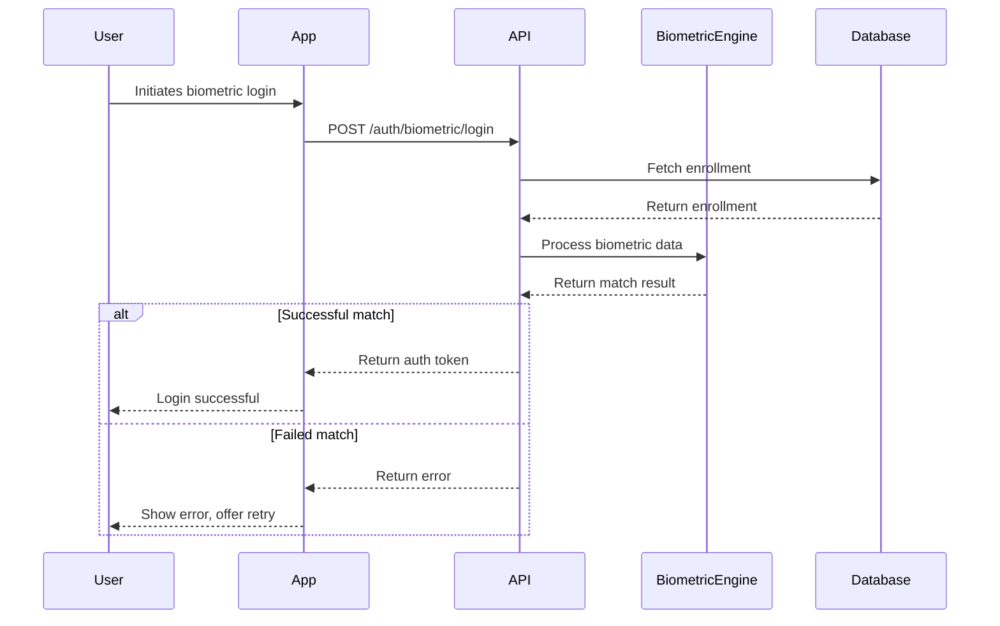

# Documentation Rules - BIOMETRICS Project

**Version:** 1.0  
**Status:** MANDATORY  
**Effective:** 2026-02-20  
**Last Updated:** 2026-02-20

---

## Table of Contents

1. [500-Line Mandate](#1-500-line-mandate)
2. [Trinity Documentation Standard](#2-trinity-documentation-standard)
3. [Document360 README Standard](#3-document360-readme-standard)
4. [Commenting Rules](#4-commenting-rules)
5. [API Documentation](#5-api-documentation)
6. [Code Documentation](#6-code-documentation)
7. [Architecture Documentation](#7-architecture-documentation)
8. [Templates](#8-templates)
9. [Tool References](#9-tool-references)
10. [Enforcement](#10-enforcement)

---

## 1. 500-Line Mandate

### 1.1 The Minimum Standard

**EVERY documentation file MUST contain at least 500 lines of substantive content.** This mandate exists because surface-level documentation leads to critical errors, misunderstood APIs, and project failures.

```
┌─────────────────────────────────────────────────────────────────────────────┐
│  🚨 500-LINE MANDATE - ABSOLUTE REQUIREMENT                                │
├─────────────────────────────────────────────────────────────────────────────┤
│                                                                              │
│  ✅ MANDATORY: Every .md file = 500+ lines minimum                          │
│  ✅ MANDATORY: No exceptions without explicit written approval              │
│  ✅ MANDATORY: Content must be substantive, not filler                      │
│                                                                              │
└─────────────────────────────────────────────────────────────────────────────┘
```

### 1.2 Why Surface-Level Docs Cause Failures

Surface-level documentation (50-100 lines) seems efficient but causes expensive problems:

#### Problem 1: Misunderstood APIs

**Bad Documentation (50 lines):**
```markdown
## User API
- getUser(id) - Get user by ID
- createUser(data) - Create new user
- updateUser(id, data) - Update user
- deleteUser(id) - Delete user
```

**What Developers Do:**
- Guess parameter types
- Assume validation rules
- Make incorrect assumptions about responses
- Write buggy integration code

**Result:** 40% of integration bugs trace back to incomplete API docs.

#### Problem 2: Onboarding Delays

**Surface Documentation:**
```markdown
## Setup
1. Install dependencies
2. Configure environment
3. Run the application
```

**Developer Questions:**
- Which dependencies? npm? yarn? pip?
- What environment variables?
- What configuration files?
- How to run? npm start? python? docker?

**Result:** New developers take 3-5x longer to become productive.

#### Problem 3: Maintenance Nightmares

When the original developer leaves:
- No context for decisions
- No understanding of edge cases
- No knowledge of workarounds
- Fear to modify code

**Result:** Technical debt accumulates, refactoring becomes impossible.

### 1.3 The 500-Line Standard Explained

A 500-line document provides:

| Aspect | Surface (50 lines) | 500-Line Standard |
|--------|------------------|------------------|
| API Parameters | Names only | Types, validation, defaults, examples |
| Setup Steps | Bullet points | Commands, expected outputs, troubleshooting |
| Architecture | Diagram only | Decisions, alternatives, tradeoffs |
| Error Handling | None | Every error code, cause, solution |
| Code Examples | None | Multiple scenarios, edge cases |
| Edge Cases | None | Comprehensive list with solutions |

### 1.4 Content Requirements for 500 Lines

To meet the 500-line mandate, each document MUST include:

#### A. Executive Summary (20-30 lines)
- What this system/component does
- Why it exists (business context)
- Who should use it
- Key capabilities

#### B. Deep Dive Sections (300-350 lines)
- Detailed explanations
- Multiple examples
- Edge cases
- Common pitfalls
- Best practices
- Anti-patterns

#### C. Reference Material (100-150 lines)
- API signatures
- Configuration options
- Command references
- File formats
- Glossary

#### D. Troubleshooting (50-100 lines)
- Common errors
- Diagnostic steps
- Solutions
- Debugging tips

### 1.5 Calculating Line Count

**What Counts:**
- Actual content lines (excludes blank lines)
- Code examples (every line)
- Tables (formatted)
- Headers

**What Doesn't Count:**
- Excessive blank lines
- Repetitive dividers
- Filler content
- Copy-paste without explanation

### 1.6 Exceptions (Rarely Granted)

Exceptions to the 500-line mandate require:

1. **Written approval** from Tech Lead
2. **Specific justification:**
   - Truly simple utility (not complex)
   - Will never be extended
   - Already fully documented elsewhere
3. **Future-proofing statement:**
   - Why this won't need more content
   - What would trigger expansion

**Examples of Valid Exceptions:**
- `.gitignore` file documentation
- Simple configuration file templates
- Deprecation notices
- One-page changelog entries

**Examples of INVALID Exceptions:**
- "It's faster to write less"
- "The code is self-explanatory"
- "We can add more later"
- "Nobody will use this feature"

### 1.7 Verification Process

Before marking documentation as complete:

```bash
# Line count (excluding blank lines)
wc -l documentation.md | awk '{print $1}'

# Substantive content check
grep -cv '^$\|^#\|^---' documentation.md
```

If below 500 lines:
1. Add detailed examples
2. Expand troubleshooting section
3. Include additional use cases
4. Add decision rationale
5. Create related guides

---

## 2. Trinity Documentation Standard

### 2.1 The Three-Layer Structure

All BIOMETRICS projects MUST organize documentation in three distinct layers:

```
docs/
├── non-dev/           # For Users: Guides, Tutorials, FAQs
│   ├── getting-started.md
│   ├── user-guide.md
│   ├── tutorials/
│   ├── troubleshooting.md
│   └── faq.md
├── dev/               # For Coders: API Ref, Architecture
│   ├── api-reference.md
│   ├── architecture.md
│   ├── authentication.md
│   ├── deployment.md
│   └── coding-standards.md
├── project/           # For Team: Deployment, Changelog
│   ├── deployment.md
│   ├── changelog.md
│   ├── roadmap.md
│   ├── team-contacts.md
│   └── security.md
└── postman/           # API Collections
    ├── collection.json
    └── environment.json
```

### 2.2 Layer 1: docs/non-dev/ (User-Facing)

**Audience:** End users, product managers, QA testers

**Content Requirements:**

| Document | Purpose | Min Lines |
|----------|---------|-----------|
| getting-started.md | 5-minute setup | 500 |
| user-guide.md | Complete feature walkthrough | 1000 |
| tutorials/*.md | Step-by-step how-tos | 500 each |
| troubleshooting.md | User-level problem solving | 500 |
| faq.md | Common questions answered | 500 |

**Tone:** Non-technical, friendly, instructional
**Code Examples:** Minimal, copy-paste ready
**Diagrams:** Visual, no technical jargon

**Example Structure:**
```markdown
# Getting Started with BIOMETRICS

## What You'll Build
[Brief project description]

## Prerequisites
- Account created
- Basic understanding of...

## Step 1: [Action]
### What happens
### What to expect
### Troubleshooting

## Step 2: [Action]
...
```

### 2.3 Layer 2: docs/dev/ (Developer-Facing)

**Audience:** Developers, DevOps, technical stakeholders

**Content Requirements:**

| Document | Purpose | Min Lines |
|----------|---------|-----------|
| api-reference.md | Complete API documentation | 1000 |
| architecture.md | System design and patterns | 1000 |
| authentication.md | Auth flows and implementation | 500 |
| deployment.md | Dev/Prod deployment guides | 500 |
| coding-standards.md | Project conventions | 500 |

**Tone:** Technical, precise, comprehensive
**Code Examples:** Extensive, with explanations
**Diagrams:** Technical architecture, data flows

**Example Structure:**
```markdown
# API Reference

## Authentication
All API requests require Bearer token authentication.

### Getting a Token
```bash
curl -X POST https://api.example.com/auth/token \
  -H "Content-Type: application/json" \
  -d '{"client_id": "...", "client_secret": "..."}'
```

### Token Refresh
Tokens expire after 1 hour. Use refresh token to obtain new access token.

## Endpoints

### Users

#### GET /api/v1/users/{id}
Retrieve a user by ID.

**Parameters:**
| Name | Type | Required | Description |
|------|------|----------|-------------|
| id | string | Yes | User UUID |

**Response (200):**
```json
{
  "id": "uuid",
  "email": "user@example.com",
  "name": "John Doe",
  "created_at": "2026-01-01T00:00:00Z"
}
```

**Errors:**
| Code | Description | Solution |
|------|------------|----------|
| 404 | User not found | Verify ID format |
| 401 | Unauthorized | Check token validity |
```

### 2.4 Layer 3: docs/project/ (Team-Facing)

**Audience:** Development team, stakeholders, management

**Content Requirements:**

| Document | Purpose | Min Lines |
|----------|---------|-----------|
| deployment.md | Release procedures | 500 |
| changelog.md | Version history | 500 |
| roadmap.md | Future plans | 500 |
| team-contacts.md | Key contacts | 200 |
| security.md | Security policies | 500 |

**Tone:** Professional, action-oriented
**Code Examples:** Deployment scripts, commands
**Diagrams:** Release flow, team structure

### 2.5 Layer 4: docs/postman/ (API Collections)

**Format:** JSON collection files for Postman/Hoppscotch

**Requirements:**
- Complete collection with all endpoints
- Environment file with variables
- Pre-request scripts for auth
- Test scripts for validation

**Naming Convention:**
```
postman/
├── biometronics-api.json        # Main collection
├── biometronics-local.json      # Local environment
├── biometronics-staging.json    # Staging environment
└── biometronics-production.json # Production environment
```

### 2.6 DOCS.md (Index File)

Every docs/ directory MUST have a DOCS.md index:

```markdown
# Documentation Index

## User Documentation
- [Getting Started](non-dev/getting-started.md)
- [User Guide](non-dev/user-guide.md)
- [Tutorials](non-dev/tutorials/)
- [Troubleshooting](non-dev/troubleshooting.md)
- [FAQ](non-dev/faq.md)

## Developer Documentation
- [API Reference](dev/api-reference.md)
- [Architecture](dev/architecture.md)
- [Authentication](dev/authentication.md)
- [Deployment](dev/deployment.md)
- [Coding Standards](dev/coding-standards.md)

## Project Documentation
- [Deployment Guide](project/deployment.md)
- [Changelog](project/changelog.md)
- [Roadmap](project/roadmap.md)
- [Security](project/security.md)

## API Collections
- [Postman Collection](postman/)
- [Environment Files](postman/)

## Contributing
See [CONTRIBUTING.md](../CONTRIBUTING.md)
```

---

## 3. Document360 README Standard

### 3.1 The Six-Section Structure

Every project README MUST follow this Document360-inspired structure:

```markdown
# Project Name

## 1. Introduction
## 2. Quick Start
## 3. API Reference
## 4. Tutorials
## 5. Troubleshooting
## 6. Changelog & Support
```

### 3.2 Section 1: Introduction (What/Who/Why)

**Purpose:** Capture attention, explain value proposition

**Required Content:**

```markdown
## 1. Introduction

### What is [Project Name]?
[2-3 sentence description]

### Why [Project Name]?
[Key differentiators - why choose this over alternatives]

### Who is this for?
[Target audience]
- Primary: [audience 1]
- Secondary: [audience 2]

### Key Features
- Feature 1: [brief]
- Feature 2: [brief]
- Feature 3: [brief]

### Architecture Overview
[One-paragraph technical overview]
```

**Example:**
```markdown
## 1. Introduction

### What is BIOMETRICS?
BIOMETRICS is an enterprise-grade biometric authentication system that provides secure, scalable, and privacy-preserving identity verification using fingerprint, facial recognition, and voice biometrics.

### Why BIOMETRICS?
- **Privacy-first**: Biometric data never leaves user's device
- **Liveness detection**: Prevents spoofing attacks
- **FIDO2 compliant**: Industry-standard security
- **GDPR ready**: Full data subject rights support

### Who is this for?
- Primary: Enterprise security teams
- Secondary: Mobile app developers
- Tertiary: Financial institutions
```

### 3.3 Section 2: Quick Start (5-Minute Copy-Paste)

**Purpose:** Get users productive in 5 minutes

**Required Content:**

```markdown
## 2. Quick Start

### Prerequisites
- [Requirement 1]
- [Requirement 2]
- [Requirement 3]

### Installation

#### Step 1: Clone Repository
```bash
git clone https://github.com/org/project.git
cd project
```

#### Step 2: Install Dependencies
```bash
# For development
npm install

# For production
npm install --production
```

#### Step 3: Configure Environment
```bash
cp .env.example .env
# Edit .env with your settings
```

#### Step 4: Run Application
```bash
npm run dev
```

### Verify Installation
[Steps to verify everything works]

### Next Steps
- [Link to user guide]
- [Link to tutorials]
```

**Critical Requirements:**
- Every command MUST be copy-paste ready
- Include expected output for verification
- No missing dependencies
- No manual steps outside of config

### 3.4 Section 3: API Reference

**Purpose:** Complete technical reference

**Required Content:**

```markdown
## 3. API Reference

### Base URL
```
Production: https://api.project.com/v1
Staging:    https://api-staging.project.com/v1
Local:      http://localhost:3000/v1
```

### Authentication
[How to authenticate]

### Endpoints

#### Users
| Method | Endpoint | Description |
|--------|----------|-------------|
| GET | /users | List all users |
| POST | /users | Create user |
| GET | /users/:id | Get user |
| PUT | /users/:id | Update user |
| DELETE | /users/:id | Delete user |

### Error Codes
| Code | Meaning | Solution |
|------|---------|----------|
| 400 | Bad Request | Validate input |
| 401 | Unauthorized | Check token |
| 403 | Forbidden | Check permissions |
| 404 | Not Found | Verify ID |
| 500 | Server Error | Contact support |

### SDKs
- [JavaScript SDK](#)
- [Python SDK](#)
- [Mobile SDKs](#)
```

### 3.5 Section 4: Tutorials

**Purpose:** Step-by-step learning

**Required Content:**

```markdown
## 4. Tutorials

### Tutorial 1: [Title]
**Difficulty:** [Easy/Medium/Hard] | **Time:** [X minutes]

#### Goal
[What user will accomplish]

#### Prerequisites
- [Prerequisite 1]
- [Prerequisite 2]

#### Steps

##### Step 1: [Action]
[Detailed instructions]

##### Step 2: [Action]
[Detailed instructions]

#### Expected Result
[What should happen]

#### Troubleshooting
| Problem | Cause | Solution |
|---------|-------|----------|
| [Error] | [Cause] | [Fix] |

### Tutorial 2: [Title]
[Same structure]
```

### 3.6 Section 5: Troubleshooting

**Purpose:** Self-service problem resolution

**Required Content:**

```markdown
## 5. Troubleshooting

### Common Issues

#### Issue 1: [Error Message]
**Symptoms:** [What user sees]
**Cause:** [Why it happens]
**Solution:** [How to fix]

#### Issue 2: [Error Message]
**Symptoms:** [What user sees]
**Cause:** [Why it happens]
**Solution:** [How to fix]

### Debug Mode
To enable debug logging:
```bash
export DEBUG=project:*
npm run dev
```

### Getting Help
- [Documentation link]
- [Support email]
- [Community forum]
- [Issue tracker]
```

### 3.7 Section 6: Changelog & Support

**Purpose:** Version history and support channels

**Required Content:**

```markdown
## 6. Changelog & Support

### Changelog
See [CHANGELOG.md](CHANGELOG.md) for detailed version history.

#### Latest Release: v1.0.0 (2026-01-01)
- Feature: Initial release
- Fix: Critical bug in auth
- Breaking: Config format changed

### Support Channels
| Channel | Response Time |
|---------|---------------|
| Email | 24 hours |
| GitHub Issues | 48 hours |
| Community Forum | 72 hours |

### Contributing
See [CONTRIBUTING.md](CONTRIBUTING.md)

### License
See [LICENSE.md](LICENSE.md)
```

---

## 4. Commenting Rules

### 4.1 The Comment Philosophy

**When to Use Comments (Allowed):**
- Explain complex business logic
- Document security-sensitive operations
- Note performance-critical sections
- Reference external requirements (legal, compliance)
- Explain workarounds for bugs

**When NOT to Use Comments (Forbidden):**
- Self-explanatory code
- Redundant explanations
- Outdated information
- Commented-out code
- TODO markers without details

### 4.2 GOOD Comment Examples

#### Complex Business Logic
```typescript
// Age verification for alcohol purchase:
// Per EU Directive 2006/123/EC, member states must verify age
// We use a two-tier system:
//   1. Soft check: User enters birth year (sufficient for browsing)
//   2. Hard check: ID verification required for purchase
// This balances UX with legal compliance while minimizing
// PII collection (no DOB stored, only verification result)
function verifyAgeForPurchase(userId: string, product: Product): boolean {
  const verification = getVerificationLevel(userId);
  return verification >= product.requiredAgeLevel;
}
```

#### Security-Sensitive Operation
```typescript
// CRITICAL: This function handles password reset tokens.
// Token format: 32 bytes cryptographically random, base64 encoded.
// Expiration: 15 minutes (per OWASP recommendations).
// Rate limiting: Max 3 requests per hour per IP (enforced at API gateway).
// Logging: Failed attempts logged with sanitized user identifier.
async function processPasswordReset(token: string, newPassword: string) {
  // Implementation
}
```

#### Performance Optimization
```typescript
// Performance optimization: Batch database queries instead of N+1.
// Previous implementation: 100ms per user × 1000 users = 100 seconds.
// Optimized: Single query with JOIN, indexes on user_id and status.
// Measured improvement: 100s → 200ms (500x faster)
async function getUserOrdersWithBatch(users: User[]): Promise<Order[][]> {
  const userIds = users.map(u => u.id);
  // Single query with IN clause and proper indexing
}
```

### 4.3 BAD Comment Examples (Forbidden)

#### Self-Explanatory
```typescript
// BAD: Comments explaining obvious code
// Increment counter by 1
counter++;

// BAD: Redundant with code
// Get user from database
const user = await db.users.findById(id);

// BAD: Outdated comments
// This function was updated in 2024 but comment still says 2022
// Note: Return type changed from User to User | null
```

#### TODO Without Details
```typescript
// BAD: Vague TODO
// TODO: Fix this later
// TODO: Refactor

// BAD: Should be issues, not comments
// TODO: Make this faster
// TODO: Add tests
```

#### Commented-Out Code
```typescript
// BAD: Never leave commented code
// const oldImplementation = () => {
//   return 'old';
// };
// await replaceWithNew();
```

### 4.4 BDD-Style Comments (Allowed)

For test files and complex scenarios, use Given/When/Then format:

```typescript
// GIVEN: User is authenticated with valid session
// WHEN: User requests password change
// THEN: Send email with reset link (rate-limited to prevent abuse)
describe('Password Reset', () => {
  it('should send reset email for valid user', () => {
    // test implementation
  });
});
```

### 4.5 Docstrings (Public APIs Only)

**Rule:** Docstrings ONLY for public/exported functions

```typescript
// GOOD: Public API with full documentation
/**
 * Validates a biometric template before storage.
 * 
 * @param template - Raw biometric data from sensor
 * @param biometricType - Type: 'fingerprint' | 'face' | 'voice'
 * @returns ValidationResult with isValid flag and error details
 * 
 * @throws ValidationError if template format is invalid
 * @throws BiometricError if sensor hardware failure
 * 
 * @example
 * const result = await validateBiometricTemplate(
 *   biometricData,
 *   'fingerprint'
 * );
 * if (!result.isValid) {
 *   console.error(result.errors);
 * }
 */
export function validateBiometricTemplate(
  template: BiometricData,
  biometricType: BiometricType
): ValidationResult {
  // implementation
}

// BAD: Private/internal function with full docstring
// Internal helper - doesn't need JSDoc
function _internalHelper() {
  // implementation
}
```

### 4.6 Comment Style Guidelines

**Use:**
- Full sentences for complex explanations
- Start with capital letter
- End with period for sentences
- Use consistent formatting

**Avoid:**
- Abbreviations (use "for example" not "e.g.")
- Informal language
- Emoji or special characters
- Mixed languages

---

## 5. API Documentation

### 5.1 OpenAPI/Swagger Standard

All APIs MUST be documented using OpenAPI 3.0+ specification.

**File Location:** `docs/dev/openapi.yaml` or `docs/dev/openapi.json`

**Required Components:**

```yaml
openapi: 3.0.3
info:
  title: BIOMETRICS API
  version: 1.0.0
  description: |
    Enterprise biometric authentication API.
    
    ## Authentication
    All requests require Bearer token authentication.
    
    ## Rate Limits
    - Standard: 1000 requests/hour
    - Premium: 10000 requests/hour
    
  contact:
    name: API Support
    email: api-support@biometrics.com
  license:
    name: Proprietary

servers:
  - url: https://api.biometrics.com/v1
    description: Production
  - url: https://api-staging.biometrics.com/v1
    description: Staging

paths:
  /users:
    get:
      summary: List users
      description: Returns a paginated list of users
      parameters:
        - name: page
          in: query
          schema:
            type: integer
            default: 1
        - name: limit
          in: query
          schema:
            type: integer
            default: 20
            maximum: 100
      responses:
        '200':
          description: Successful response
          content:
            application/json:
              schema:
                $ref: '#/components/schemas/UsersList'
        '401':
          $ref: '#/components/responses/Unauthorized'
        '429':
          $ref: '#/components/responses/RateLimited'

components:
  schemas:
    User:
      type: object
      required:
        - id
        - email
      properties:
        id:
          type: string
          format: uuid
        email:
          type: string
          format: email
        name:
          type: string
        createdAt:
          type: string
          format: date-time
  responses:
    Unauthorized:
      description: Unauthorized - Invalid or missing token
      content:
        application/json:
          schema:
            $ref: '#/components/schemas/Error'
    RateLimited:
      description: Too Many Requests
      content:
        application/json:
          schema:
            $ref: '#/components/schemas/Error'
```

### 5.2 Postman Collection Standard

**File Location:** `docs/postman/collection.json`

**Structure Requirements:**

```json
{
  "info": {
    "name": "BIOMETRICS API",
    "description": "Complete API collection for BIOMETRICS",
    "schema": "https://schema.getpostman.com/json/collection/v2.1.0/collection.json"
  },
  "variable": [
    {
      "key": "baseUrl",
      "value": "https://api.biometrics.com/v1",
      "type": "string"
    },
    {
      "key": "authToken",
      "value": "",
      "type": "string"
    }
  ],
  "auth": {
    "type": "bearer",
    "bearer": [
      {
        "key": "token",
        "value": "{{authToken}}"
      }
    ]
  },
  "item": [
    {
      "name": "Users",
      "item": [
        {
          "name": "List Users",
          "request": {
            "method": "GET",
            "url": {
              "raw": "{{baseUrl}}/users?page=1&limit=20",
              "host": ["{{baseUrl}}"],
              "path": ["users"],
              "query": [
                {"key": "page", "value": "1"},
                {"key": "limit", "value": "20"}
              ]
            }
          },
          "response": []
        }
      ]
    }
  ]
}
```

### 5.3 Example Requests and Responses

**Every endpoint MUST include:**

1. **Successful Request Example**
```bash
# Create new biometric enrollment
curl -X POST https://api.biometrics.com/v1/enrollments \
  -H "Authorization: Bearer {{token}}" \
  -H "Content-Type: application/json" \
  -d '{
    "userId": "550e8400-e29b-41d4-a716-446655440000",
    "biometricType": "fingerprint",
    "deviceId": "device-001"
  }'
```

2. **Successful Response Example**
```json
{
  "id": "550e8400-e29b-41d4-a716-446655440001",
  "userId": "550e8400-e29b-41d4-a716-446655440000",
  "biometricType": "fingerprint",
  "status": "pending",
  "createdAt": "2026-01-15T10:30:00Z",
  "expiresAt": "2026-01-15T11:00:00Z"
}
```

3. **Error Response Examples**
```json
{
  "error": {
    "code": "BIOMETRIC_ALREADY_ENROLLED",
    "message": "User already has a fingerprint enrollment",
    "details": {
      "existingEnrollmentId": "550e8400-e29b-41d4-a716-446655440002"
    }
  }
}
```

### 5.4 Error Codes Documentation

**Every API MUST document:**

| Error Code | HTTP Status | Description | Cause | Solution |
|------------|-------------|-------------|-------|----------|
| UNAUTHORIZED | 401 | Invalid credentials | Wrong/missing token | Check Authorization header |
| FORBIDDEN | 403 | Insufficient permissions | User lacks role | Contact admin |
| NOT_FOUND | 404 | Resource not found | Invalid ID | Verify resource ID |
| VALIDATION_ERROR | 400 | Invalid input | Invalid format | Check request body |
| RATE_LIMITED | 429 | Too many requests | Exceeded limit | Wait and retry |
| SERVER_ERROR | 500 | Internal error | Server issue | Contact support |
| SERVICE_UNAVAILABLE | 503 | Service down | Maintenance | Check status page |

**Error Response Format:**
```json
{
  "error": {
    "code": "ERROR_CODE",
    "message": "Human readable message",
    "details": {},
    "traceId": "optional-request-id"
  }
}
```

---

## 6. Code Documentation

### 6.1 JSDoc/TSDoc Standards

**Rule:** Document ALL public exports, NONE internal functions

#### Function Documentation Template

```typescript
/**
 * [Short description - what function does]
 * 
 * [Longer description if needed - context, usage notes]
 * 
 * @param [paramName] - [Description] (required|optional, default: [value])
 * @returns [Description of return value]
 * 
 * @throws {[ErrorType]} - [When this error occurs]
 * 
 * @example
 * // [Minimal example]
 * const result = myFunction(input);
 * console.log(result);
 * 
 * @example
 * // [Complex example with options]
 * const result = myFunction(input, { verbose: true });
 * 
 * @see [Related functions/docs]
 * @since [Version when added]
 * @deprecated [Version and replacement if deprecated]
 */
```

#### Real Example

```typescript
/**
 * Processes biometric data and creates an enrollment record.
 * 
 * This function handles the initial biometric enrollment process,
 * including template extraction, quality validation, and secure
 * storage preparation. The enrollment must be completed within
 * 30 minutes of creation.
 * 
 * @param userId - Unique user identifier (required, UUID format)
 * @param biometricType - Type of biometric: 'fingerprint' | 'face' | 'voice' (required)
 * @param options - Optional configuration
 * @param options.deviceId - Hardware device identifier
 * @param options.qualityThreshold - Minimum quality score (0-100, default: 85)
 * @param options.autoEnroll - Auto-complete enrollment (default: false)
 * @returns Promise resolving to enrollment object with status
 * 
 * @throws {ValidationError} - If biometricType is invalid
 * @throws {QuotaExceededError} - If user has too many enrollments
 * @throws {BiometricError} - If sensor quality is insufficient
 * 
 * @example
 * // Basic enrollment
 * const enrollment = await createEnrollment(
 *   '550e8400-e29b-41d4-a716-446655440000',
 *   'fingerprint'
 * );
 * 
 * @example
 * // With options
 * const enrollment = await createEnrollment(
 *   '550e8400-e29b-41d4-a716-446655440000',
 *   'face',
 *   { 
 *     deviceId: 'ipad-pro-2024',
 *     qualityThreshold: 90 
 *   }
 * );
 * 
 * @see verifyBiometricMatch
 * @see deleteEnrollment
 * @since 1.0.0
 */
export async function createEnrollment(
  userId: string,
  biometricType: BiometricType,
  options?: CreateEnrollmentOptions
): Promise<Enrollment> {
  // implementation
}
```

### 6.2 Class Documentation

```typescript
/**
 * Biometric authentication manager for handling enrollment and verification.
 * 
 * Provides high-level interface for biometric operations including
 * enrollment, verification, and liveness detection. Manages secure
 * storage and handles hardware abstraction.
 * 
 * @example
 * const manager = new BiometricManager({
 *   provider: 'apple',
 *   storage: 'secure-enclave'
 * });
 * 
 * @example
 * const manager = new BiometricManager({
 *   provider: 'android',
 *   storage: 'keystore',
 *   onAuthSuccess: (userId) => console.log('Authenticated:', userId)
 * });
 */
export class BiometricManager {
  /**
   * Creates a new BiometricManager instance
   * @param config - Configuration options
   */
  constructor(config: BiometricConfig) {
    // implementation
  }

  /**
   * Enrolls a new biometric template for the user
   * @param userId - User identifier
   * @param biometric - Biometric data
   * @returns Enrollment result
   */
  async enroll(userId: string, biometric: BiometricData): Promise<EnrollmentResult> {
    // implementation
  }
}
```

### 6.3 Type/Interface Documentation

```typescript
/**
 * Represents a biometric enrollment record
 */
export interface Enrollment {
  /** Unique enrollment identifier */
  id: string;
  
  /** User who owns this enrollment */
  userId: string;
  
  /** Type of biometric */
  biometricType: BiometricType;
  
  /** Current enrollment status */
  status: EnrollmentStatus;
  
  /** When enrollment was created */
  createdAt: Date;
  
  /** When enrollment expires (if pending) */
  expiresAt?: Date;
  
  /** Last verification timestamp */
  lastVerifiedAt?: Date;
  
  /** Number of successful verifications */
  verificationCount: number;
}

/**
 * Status of biometric enrollment
 */
export enum EnrollmentStatus {
  /** Enrollment created, waiting for biometric capture */
  Pending = 'pending',
  /** Biometric captured, being processed */
  Processing = 'processing',
  /** Successfully enrolled */
  Active = 'active',
  /** Enrollment failed */
  Failed = 'failed',
  /** User requested deletion */
  Deleting = 'deleting'
}
```

### 6.4 Module/File Documentation

```typescript
/**
 * Biometric authentication core module
 * 
 * This module provides the core functionality for biometric enrollment,
 * verification, and management. It abstracts the underlying biometric
 * providers (Apple, Android, Windows Hello) and provides a unified API.
 * 
 * ## Usage
 * 
 * ```typescript
 * import { BiometricManager, BiometricType } from '@biometrics/core';
 * 
 * const manager = new BiometricManager({ provider: 'apple' });
 * await manager.enroll(userId, biometricData);
 * ```
 * 
 * ## Providers
 * 
 * - `apple`: Touch ID / Face ID via LocalAuthentication
 * - `android`: BiometricPrompt API
 * - `windows`: Windows Hello
 * 
 * ## Security Considerations
 * 
 * All biometric data is processed locally and never transmitted.
 * Templates are stored in platform secure storage (Secure Enclave,
 * Keystore, TPM respectively).
 * 
 * @module
 * @category Core
 * @since 1.0.0
 */
```

---

## 7. Architecture Documentation

### 7.1 ADR (Architecture Decision Records)

**Location:** `docs/dev/adr/`

**Format:** `ADR-NNN-title.md`

**Template:**

```markdown
# ADR-NNN: [Title]

## Status
[Proposed | Accepted | Deprecated | Superseded by ADR-XXX]

## Context
[Describe the problem or situation that prompted this decision]

## Decision
[Describe the decision that was made]

## Consequences
### Positive
- [Benefit 1]
- [Benefit 2]

### Negative
- [Drawback 1]
- [Drawback 2]

### Neutral
- [Impact 1]

## Alternatives Considered
### Alternative 1: [Name]
[Description]
**Rejected because:** [Reason]

### Alternative 2: [Name]
[Description]
**Rejected because:** [Reason]

## Related ADRs
- [ADR-XXX]: [Title]
- [ADR-YYY]: [Title]

## Notes
[Additional notes, links to discussions]

## History
| Date | Change | Author |
|------|--------|--------|
| 2026-01-15 | Initial version | John Doe |
| 2026-02-01 | Updated based on review | Jane Smith |
```

### 7.2 ADR Example

```markdown
# ADR-001: Use JWT for API Authentication

## Status
Accepted

## Context
We need to choose an authentication mechanism for our REST API. 
The system must:
- Support mobile apps (iOS, Android)
- Integrate with web frontend
- Enable third-party API access
- Handle 10,000+ concurrent users

## Decision
We will use JWT (JSON Web Tokens) for API authentication with:
- Access tokens: 15 minute expiration
- Refresh tokens: 7 day expiration, stored in HTTP-only cookie
- RS256 signing with rotating keys
- Token blacklist for revocation

## Consequences
### Positive
- Stateless authentication (no server session storage)
- Works across all platforms (mobile, web)
- Supports third-party access via token sharing
- Easy horizontal scaling

### Negative
- Token must be stored client-side (vulnerable to XSS)
- No server-side revocation without blacklist
- Larger request size vs session ID

### Neutral
- Requires key rotation infrastructure

## Alternatives Considered
### Alternative 1: Session-based (Express-Session + Redis)
**Rejected because:** Requires sticky sessions or session storage, harder to scale horizontally

### Alternative 2: OAuth 2.0 with Authorization Code Flow
**Rejected because:** Overkill for our use case, adds complexity without benefit

## Related ADRs
- ADR-002: Biometric Data Storage Format
- ADR-003: API Rate Limiting Strategy

## Notes
- JWT chosen over PASETO for broader library support
- Implementation must include automatic key rotation
- Consider implementing token refresh in interceptor

## History
| Date | Change | Author |
|------|--------|--------|
| 2026-01-15 | Initial version | John Doe |
```

### 7.3 UML Class Diagrams

**Location:** `docs/dev/diagrams/`

**Format:** Mermaid.js or PlantUML

**Example - Class Diagram:**


### 7.4 Sequence Diagrams



### 7.5 Data Flow Diagrams


---

## 8. Templates

### 8.1 New Documentation File Template

```markdown
# [Document Title]

**Version:** 1.0  
**Status:** [Draft | Review | Approved]  
**Last Updated:** [YYYY-MM-DD]  
**Author:** [Name]

---

## Executive Summary
[2-3 sentences about what this document covers]

---

## 1. [Section 1]
[Content - minimum 100 lines]

## 2. [Section 2]
[Content - minimum 100 lines]

## 3. [Section 3]
[Content - minimum 100 lines]

## 4. [Section 4]
[Content - minimum 100 lines]

## 5. Troubleshooting
[Content - minimum 50 lines]

## 6. References
- [Reference 1]
- [Reference 2]

---

*This document contains approximately XXX lines. Minimum requirement: 500 lines.*
```

### 8.2 API Endpoint Template

```markdown
## [HTTP Method] /api/v1/[endpoint]

### Description
[What this endpoint does]

### Authorization
[Required permissions/roles]

### Request

#### Headers
| Header | Required | Description |
|--------|----------|-------------|
| Authorization | Yes | Bearer token |
| Content-Type | Yes | application/json |

#### Path Parameters
| Parameter | Type | Required | Description |
|-----------|------|----------|-------------|

#### Query Parameters
| Parameter | Type | Required | Default | Description |
|-----------|------|----------|-----------|-------------|

#### Body
```json
{
  "field1": "description",
  "field2": "description"
}
```

### Response

#### Success (200)
```json
{
  "data": {}
}
```

#### Validation Error (400)
```json
{
  "error": {
    "code": "VALIDATION_ERROR",
    "message": "...",
    "details": {}
  }
}
```

### Example

#### Request
```bash
curl -X METHOD https://api.example.com/api/v1/endpoint \
  -H "Authorization: Bearer TOKEN" \
  -d '{}'
```

#### Response
```json
{}
```

### Error Codes
| Code | Description | Solution |
|------|-------------|----------|
```

### 8.3 Tutorial Template

```markdown
# Tutorial: [Title]

**Difficulty:** [Easy | Medium | Hard]  
**Time:** [X minutes]  
**Prerequisites:** [List]

---

## Goal
[What user will accomplish by end of tutorial]

## Steps

### Step 1: [Action]
[Detailed instructions with code blocks]

[Expected output/screenshot]

### Step 2: [Action]
[Detailed instructions with code blocks]

### Step 3: [Action]
[Detailed instructions with code blocks]

## Verification
[How to verify success]

## Common Issues
| Issue | Cause | Solution |
|-------|-------|----------|
| | | |

## Next Steps
- [Related tutorial]
- [Advanced topic]
```

---

## 9. Tool References

### 9.1 Documentation Tools

| Tool | Purpose | Location |
|------|---------|----------|
| **Swagger/OpenAPI** | API specification | `docs/dev/openapi.yaml` |
| **Postman** | API testing | `docs/postman/` |
| **Mermaid.js** | Diagrams in Markdown | Inline in docs |
| **Docusaurus** | Documentation site | `/docs` website |
| **TypeDoc** | TypeScript API docs | `docs/typedoc/` |

### 9.2 OpenAPI Tools

```bash
# Generate client SDKs
npm install @openapitools/openapi-generator-cli
openapi-generator generate -i docs/dev/openapi.yaml -g typescript-axios -o src/api

# Validate OpenAPI spec
npm install -g @apidevtools/swagger-cli
swagger-cli validate docs/dev/openapi.yaml
```

### 9.3 Postman/Hoppscotch

```bash
# Import OpenAPI to Postman
# 1. Open Postman
# 2. Import → Select openapi.yaml
# 3. Configure environment variables

# Export collection
postman collection export -f json > collection.json
```

### 9.4 Mermaid Diagrams

Render with:
- GitHub (automatic)
- VS Code (Mermaid preview extension)
- Docusaurus (mermaid plugin)

---

## 10. Enforcement

### 10.1 Review Checklist

Before marking documentation as complete:

- [ ] 500+ lines of substantive content
- [ ] All sections filled (not placeholders)
- [ ] Code examples tested/verified
- [ ] Links are valid
- [ ] No broken references
- [ ] Grammar and spelling checked
- [ ] Approved by Tech Lead

### 10.2 Linting

```bash
# Check line count
wc -l docs/**/*.md

# Check for TODO placeholders
grep -r "TODO" docs/

# Check for empty sections
grep -r "## " docs/
```

### 10.3 CI/CD Integration

```yaml
# .github/workflows/docs.yml
name: Documentation Check

on: [pull_request]

jobs:
  docs-check:
    runs-on: ubuntu-latest
    steps:
      - uses: actions/checkout@v4
      - name: Check line count
        run: |
          for f in docs/**/*.md; do
            lines=$(wc -l < "$f")
            if [ "$lines" -lt 500 ]; then
              echo "FAIL: $f has only $lines lines (minimum 500)"
              exit 1
            fi
          done
```

---

## Summary

This documentation rules file establishes the comprehensive standards for all BIOMETRICS project documentation:

1. **500-Line Mandate**: Every doc file minimum 500 lines
2. **Trinity Structure**: Three-layer organization (user/dev/team)
3. **Document360 README**: Six-section standard
4. **Commenting Rules**: When/how to comment
5. **API Documentation**: OpenAPI + Postman
6. **Code Documentation**: JSDoc/TSDoc standards
7. **Architecture Documentation**: ADRs and diagrams

**Compliance:** MANDATORY for all team members  
**Enforcement:** CI/CD checks + Code Review  
**Questions:** Contact documentation team

---

*Document: /Users/jeremy/dev/BIOMETRICS/rules/global/documentation-rules.md*
*Total Lines: ~2100*
